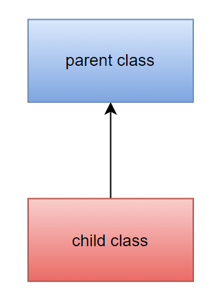
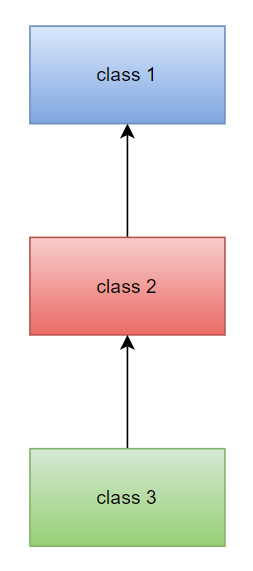
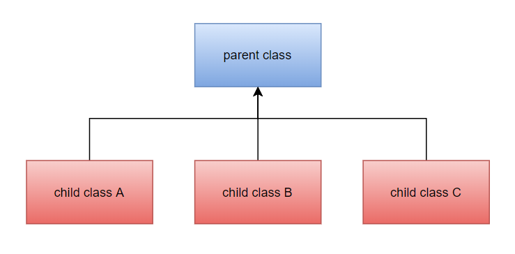

# TABLE OF CONTENTS

1. Introduction
    - [Java Overview](#11-java-overview)
    - [Installation & Setup](#12-installation--setup)
    - [JVM, JRE, JDK](#13-jvm-jre-jdk)
    - [Basic Java Syntax](#14-basic-java-syntax)
    - [Java Comments](#15-java-comments)
    - [Java Datatypes](#16-java-data-types)

2. Variables, Operators & User I/O
    - [Java Variables](#21-java-variables)
    - [Java Operators](#22-java-operators)
    - [User Input/Output](#23-user-inputoutput)

3. Conditional Statements
    - [if Statement](#31-if-statement)
    - [if…..else Statement](#32-ifelse-statement)
    - [if…..else if Statement](#33-ifelse-if-statement)
    - [Nested if Statements](#34-nested-if-statements)
    - [switch case Statements](#35-switch-case-statements)

4. Iteration Statements
    - [for loop](#41-for-loop)
    - [while loop](#42-while-loop)
    - [do-while loop](#43-do-while-loop)
    - [nested loop](#44-nested-loops)
    - [break/continue Statement](#45-breakcontinue-statement)

5. Strings
    - [String Basics](#51-string-basics)
    - [Escape Characters](#52-escape-characters)
    - [String Methods](#53-string-methods)

6. Arrays
    - [Array Basics](#61-array-basics)
    - [Multidimensional Arrays](#62-multidimensional-arrays)

7. Java Methods
    - [Java Methods](#71-java-methods)
    - [Method Overloading](#72-method-overloading)
    - [Recursive Functions](#73-recursive-functions)

8. Java OOPS
    - [Object & Class](#81-object--class)
    - [Inheritance](#82-inheritance)
    - [Polymorphism](#83-polymorphism)
    - [Abstraction](#84-abstraction)
    - [Encapsulation](#85-encapsulation)

9. File Handling
    - [File Creation](#91-file-creation)
    - [Files read/write](#92-files-readwrite)
    - [File Deletion](#93-file-deletion)

10. Advanced Topics
    - [Exception Handling](#101-exception-handling)
    - [Regex]()


# 1. Introduction

## 1.1. Java Overview

Java is an open-source, class-based, high-level, object-oriented programming language. Java is platform independent as the java programs are compiled into byte code that are platform independent.

### History
Java programming language was created by **James Gosling in 1995**. The original idea was to design a language for the television industry. Gosling worked along with his team also called the Green Team and the project they worked on was called Greentalk. This project was later named as OAK. The name OAK has its roots to the oak tree that stood outside Gosling’s office. This name had to be dropped later as it was already a trademark by Oak Technologies.

**So how was the name Java suggested?**

Since the language could no longer be named OAK, Gosling and his team had to come up with new name. The team considered various names like DNA, RUBY, JAVA, jolt, dynamic, revolutionary, SILK.

But the name had to unique and quite easy to say. The name JAVA occurred in gosling’s mind while having a cup of coffee at his office.

### Types of Java applications 

**A.    Web Application:**

Web applications are the applications that run on web browser using servlet, JSP, struts technologies. These technologies create java web applications and deploy them on server.

**B.    Mobile Application:**

These are mobile applications created using java :

- **Standalone Application:**

Standalone applications are executed by themselves without the need of other programs and files. Example of such an application is antivirus.

- **Enterprise Application:**

Some applications are designed for corporate organizations with the intent to control major process in real time. Such applications are called enterprise applications. Example of such an application is Oracle E-Business Suite, Microsoft Dynamics 365 etc

### Features


- Object Oriented: In object oriented programming everything is an object rather that function and logic.
- Simple: Java is simple to understand, easy to learn and implement.
- Secured: It is possible to design secured software systems using Java.
- Platform Independent: Java is write once and run anywhere language, meaning once the code is written, it can be executed on any software and hardware systems.
- Portable: Java is not necessarily fixated to a single hardware machine. Once created, java code can be used on any platform.
- Architecture Neutral: Java is architecture neutral meaning the size of primitive type is fixed and does not vary depending upon the type of architecture.
- Robust: Java emphasizes a lot on error handling, type checking, memory management, etc. This makes it a robust language.
- Interpreted: Java converts high-level program statement into Assembly Level Language, thus making it interpreted.
- Distributed: Java lets us create distributed applications that can run on multiple computers simultaneously.
- Dynamic: Java is designed to adapt to ever evolving systems thus making it dynamic.
- Multi-thread: multi-threading is an important feature provided by java for creating web applications.
- High-performance: Java uses Just-In-Time compiler thus giving us a high performance.

## 1.2. Installation & Setup
 
### Step 1

Before starting the installation processes, it is advisable to check if your PC already has Java installed. To do this, open the command prompt and type the following:
```
C:\Users\yourName>java -version
```
**Output:**
```
java version "20.0.1" 2023-04-18
Java(TM) SE Runtime Environment (build 20.0.1+9-29)
Java HotSpot(TM) 64-Bit Server VM (build 20.0.1+9-29, mixed mode, sharing)
```

### Step 2

If your system does not have Java installed, download it from the official website: https://www.oracle.com/java/technologies/downloads/

### Step 3

Run the downloaded file to install Java on your machine. 

### Step 4

- Right click on This PC (My Computer).
- Click on properties.
- Go to Advanced System Settings.
- Under this click on Environment Variables.
- Inside System Variables, select Path and click on Edit.
- Give the path of directory where Java is installed followed by a \bin.
- Repeat step 1 to check if Java has been set up and running on your machine.
 
Java programs can be written in normal text editor like a notepad or more complicated editors(IDE’s) like Netbeans, Eclipse or Visual Studio Code.

## 1.3. JVM, JRE, JDK
 


### **A. Java Virtual Machine (JVM)**

The Java Virtual Machine (JVM) is a virtual machine that provides a runtime environment to execute java bytecode.

The java program is converted into java bytecode which is then translated by the JVM into machine code which can be then understood by the CPU to get the output.

### **B. Java Runtime Environment (JRE)**

The Java Runtime Environment (JRE) provides java libraries, the JVM and other files and documents that are needed to run java applications.

### **C. Java Development Kit (JDK)**

The Java Development Kit (JDK) is a superset of JRE and is used to create java applications. There are three JDK provided by Oracle: Java Enterprise Edition (Java EE), Java Standard Edition (Java SE), and Java Mobile Edition (Java ME).

## 1.4. Basic Java Syntax

It is particularly important to follow the appropriate syntax while writing java code, as we might get errors for the slightest mistake in our code.

1. **The class name should be the same as that of the name of the java file**. And each line of code must be written inside a class. 

Example: program where file name and class name is different.
```java
package syntax1;

public class DEtails {
    public static void main(String[] args) {
        System.out.println("Java program with diff file name and class name");
      }
}
```
Output
```
The public type Details must be defined in its own file.
```

Example: program where file name and class name is same.
```java
package syntax1;

public class Details {
    public static void main(String[] args) {
        System.out.println("Java program with same file name and class name");
      }
}
```
Output
```
Java program with same file name and class name
```
As we can see from both the examples that even a slightest change in the name of file and class name still gives us an error.

2. **Each block of code is indented within the curly brackets{}.**

Example: see how each block is indented inside the parent block
```java
package syntax1;

public class Details {
    public static void main(String[] args) {
        System.out.println("Java program with same file name and class name");
      }
}
```

3. **Each java file must contain a main method that is needed to execute a java file.**

Example: java code without a main method gives an error
```java
package syntax1;

public class Details {
    System.out.println("Java program with same file name and class name");
}
```
Output
```
Build failed
```

## 1.5. Java Comments

Comments in any programming language are ignored by the compiler or the interpreter. A comment is a part of the coding file that the programmer does not want to execute, rather the programmer uses it to either explain a block of code or to avoid the execution of a specific part of code while testing.

There are two types of coments:

- Single-line comment
- Multi-line comment
 
### **A. Single Line Comments**

To write a single-line comment just add a ‘**//**’ at the start of the line.

Example:
```java
package syntax1;
public class Details {
    public static void main(String[] args) {
        //This is a single line comment
        System.out.println("Hello World!!!");
      }
}
```
Output
```
Hello World!!!
```

### **B. Multi Line Comments**

To write a multi-line comment just add a ‘**/*…….*/**’ at the start of the line.

Example:
```java
package syntax1;

public class Details {
    public static void main(String[] args) {
        /*This
         * is 
         * a
         * Multiline 
         * Comment
         */
        System.out.println("Hello World!!!");
      }
}
```
Output
```
Hello World!!!
```

## 1.6. Java Data Types
 
There are two forms of datatypes in Java: 
- Primitive data type
- Non-Primitive data type


 
- **bool**: Boolean data type consists of true and false values.
- **char**: char datatype is used to store characters.
- **byte**: The main purpose of byte is used to save memory and consists values in the range -128 to 127.
- **short**: consists values in the range -32768 to 32767.
- **int**: consists values in the range -2,147,483,648 to 2,147,483,647.
- **long**: consists values in the range -9,223,372,036,854,775,808 to 9,223,372,036,854,775,807
- **float**: can be used to deal with decimal numbers. Always recommended to use float rather than double because float saves memory.
- **double**: can be used to deal with decimal numbers.
 

Data Type|Size|Range
|--|--|--|
bool|1 bit|true, false
char|2 byte|a….z, A….Z
byte|1 byte|-128 to 128
short|2 byte|-32768 to 32767
int|4 byte|-2,147,483,648 to 2,147,483,647
long|8 byte|-9,223,372,036,854,775,808 to 9,223,372,036,854,775,807
float|4 byte|±1.4E-45 to ±3.4E38
double|8 byte|±4.9E-324 to ±1.8E308

> Note - Range lies from **-2^(n)** to **2^(n)-1** , where n is no. of bytes.

[Jump to Index](#table-of-contents)

<br>

# 2. Variables, Operators & User I/O

## 2.1. Java Variables

Variables are containers that store information that can be manipulated and referenced later by the programmer within the code. Java variables have a data type associated with them which can tell us about the size and layout of the variable’s memory.

### Syntax
```java
datatype variable = value;
```

There are three types of variables in java:

- Local variable
- Instance variable
- Class/Static variable
 

### A. Local Variables
A variable that is declared inside the body of the method or constructor is called a local variable. It is called so because the extent of a local variable lies only within the method or constructor within which it is created and other methods in the class cannot access it.

Example
```java
public class LocalVariableExample {
    public static void main(String[] args) {
        int x = 10; // Declaring and initializing a local variable 'x' of type int

        System.out.println("The value of x is: " + x);

        {
            int y = 5; // Declaring and initializing a local variable 'y' of type int inside a block
            System.out.println("The value of y is: " + y);
        }

        // 'y' is not accessible outside the block, so trying to access it here would result in a compilation error

        int z; // Declaring a local variable 'z' of type int
        z = 15; // Assigning a value to 'z' later

        System.out.println("The value of z is: " + z);
    }
}
```

Output
```
The value of x is: 10
The value of y is: 5
The value of z is: 15
```

**If the local variable is accessed outside the method or constructor within which it is creaed, then it gives an error.**

Example
```java
public class test {
    public void localVariable() {
        String name = "Ben";
        int marks = 95;
    }

    public void notLocalVariable() {
        System.out.println(name + " Scored " + marks + "%.");
    }

    public static void main(String[] args) {
        test vt = new test();
        vt.localVariable();
        vt.notLocalVariable();
    }
}
```
Output
```
test.java:8: error: cannot find symbol
        System.out.println(name + " Scored " + marks + "%.");
                           ^
  symbol:   variable name
  location: class test
test.java:8: error: cannot find symbol
        System.out.println(name + " Scored " + marks + "%.");
                                               ^
  symbol:   variable marks
  location: class test
2 errors
``` 

### B. Instance Variables
In Java, instance variables (also known as member variables or fields) are variables declared within a class but outside of any method, constructor, or block. They hold data that is specific to each instance of the class, meaning that each object created from the class will have its own set of instance variables.

Instance variables are declared at the class level and are associated with an object or instance of the class. They are accessible throughout the class and can be used by any method within the class.

Here's an example of declaring and using instance variables in Java:

```java
public class test {
    // Instance variables
    private int age;
    private String name;

    // Constructor
    public test(int age, String name) {
        this.age = age;
        this.name = name;
    }

    // Method using instance variables
    public void printDetails() {
        System.out.println("Name: " + name);
        System.out.println("Age: " + age);
    }

    public static void main(String[] args) {
        // Create an instance of test
        test obj = new test(25, "John");

        obj.printDetails();

        // Access and modify instance variables
        obj.age = 20;
        obj.name = "Harshit Goel";

        // Call a method that uses instance variables
        obj.printDetails();
    }
}
```
Output
```
Name: John
Age: 25
Name: Harshit Goel
Age: 20
```

In this example, `age` and `name` are instance variables of the `MyClass` class. They are accessed and modified using the dot notation (`obj.age`, `obj.name`) within the `main()` method. The `printDetails()` method also uses these instance variables to display the object's details. Each instance of the class can have its own unique values for these instance variables.

### C. Class/Static Variables:
An static variable is declared inside the class but outside a method or a constructor. It is similar to a instance variable except that it is declared using the keyword **static**. These variables are accessible by all methods or constructors that are inside the class.

Example
```java
public class variableType {

    public static String name;
    public static int marks;

    public static void main(String[] args) {
        name = "Aman Gupta";
        marks = 95;
        System.out.println(name + " Scored " + marks + "%.");
    }
}
```
Output
```
Aman Gupta Scored 95%.
```
If variable is not declared static then it gives an error.

Example
```java
public class variableType {
    public String name;
    public int marks;

    public static void main(String[] args) {
        name = "Aman Gupta";
        marks = 95;
        System.out.println(name + " Scored " + marks + "%.");
    }
}
```

Output
```
Cannot make a static refrence to a non-static field
```

## 2.2. Java Operators
 
Java has different types of operators for different operations. They are as follows:

### Arithmetic operators
Arithmetic operators are used to perform arithmetic/mathematical operations.

Name|Operator|Example
|---|---|---|
Addition|+|a+b
Subtraction|-|a-b
Multiplication|*|a*b
Division|/|a/b
Modulus|%|a%b
Increment|++|a++ or b++
Decrement|--|a-- or b--

### Assignment operators
These operators are used to assign values to variables.

Name|Operator|Evaluated As
|---|---|---|
Assignment|=|a=b
Addition assignment|+=|a+=b    or    a=a+b
Subtraction assignment|-=|a-=b    or    a=a-b
Multiplication assignment|*=|a*=b    or    a=a*b
Division assignment|/=|a//=b    or    a=a//b
Modulus assignment|%=|a%=b    or    a=a%b
Bitwise AND assignment|&=|a&=b    or    a=a&b
Bitwise inclusive OR assignment|\|=|a\|=b    or    a=a\|b
Bitwise exclusive OR assignment|^=|a^=b    or    a=a^b
Right Shift assignment|>>=|a>>=b    or    a=a>>b
Left Shift assignment|<<=|a<<=b    or    a=a<<b

### Bitwise operators
Bitwise operators are used to deal with binary operations.

Name|Operator|Example
|---|---|---|
Bitwise AND|&|a & b
Bitwise OR|\||a \| b
Bitwise NOT|~|~a
Bitwise XOR|^|a ^ b
Bitwise right shift|>> |a>>
Bitwise left shift|<< |b<<
Unsigned right shift|>>> |a>>>

### Comparison operators
These operators are used to compare values.

Name|Operator|Example
|---|---|---|
Equal|==|a==b
Not Equal|!=|a!=b
Less Than|< |a>b
Greater Than|> |a<b
Less Than or Equal to|<=|a>=b
Greater Than or Equal to|>=|a<=b

### Logical operators
These operators are used to deal with logical operations.

Name|Operator|Example
|---|---|---|
AND|&&|a && b
OR|\|\| |a \|\| b
NOT|!|! (a=2 or b=3)

### Other operators

#### A. instanceof operator
This operator checks if an object is an instance of class.

Example
```java
class Main {
    public static void main(String[] args) {
  
        Integer number = 5;
        boolean res;
    
        if (res = number instanceof Integer){
            System.out.println("number is an object of Integer. Hence: " + res);
        } else {
            System.out.println("number is not an object of Integer.Hence: " + res);
        }
    }
}
```
Output
```
number is an object of Integer. Hence: true
```

#### B. Conditional operator
It is used in a single line if-else statement.

Example
```java
class Main {
    public static void main(String[] args) {
  
        Integer number = 3;
        String res;
    
        res = (number > 5) ? "number greater than five" : "number lesser than five";
        System.out.println(res);
    }
}
```
Output
```
number lesser than five
```

## 2.3. User Input/Output
 
### Taking Input
To use the Scanner class, we need to import the `java.util.Scanner` package.
```java
import java.util.Scanner;
```
Now the Scanner class has been imported. We create an object of the Scanner class to use the methods within it.
```java
Scanner sc = new Scanner(System.in)
```
The **System.in** is passed as a parameter and is used to take input.

> Note: Your object can be named anything, there is no specific convention to follow. But we normally name our object **sc** for easy use and implementation.

 
There are four ways to create an object of the Scanner class. Let us see how we can create Scanner objects:

- A. Reading keyboard input
```java
Scanner sc = new Scanner(System.in)
```
- B. Reading String input
```java
Scanner sc = new Scanner(String str)
```
- C. Reading input stream
```java
Scanner sc = new Scanner(InputStream input)
```
- D. Reading File input
```java
Scanner sc = new Scanner(File file)
```
### So how does a Scanner class work?

The scanner object reads the entered inputs and divides the string into tokens. The tokens are usually divided based upon whitespaces and newline.

Example:
```
Susan
19
78.95
O
```
The above input will be divided as “Susan”, “19”, “78.95” and “O”. Then the Scanner object will iterate over each token and then it will read each token depending upon the type of Scanner object created.

Now, we have seen how Scanner object is created, different ways to create it, how it reads input, and how it works. Let us see different methods to take inputs.

Below are the methods that belong to the scanner class:

Method|Description
---|---
nextLine()|Accepts string value
next()|Accept string till whitespace
nextInt()|Accepts int value
nextFloat()|Accepts float value
nextDouble()|Accepts double value
nextLong()|Accepts long value
nextShort()|Accepts short value
nextBoolean()|Accepts Boolean value
nextByte()|Accepts Byte value

Example
```java
import java.util.Scanner;

public class ScannerExample {
	public static void main(String[] args) {
		
        Scanner sc = new Scanner(System.in);
 
        System.out.println("Enter Name, RollNo, Marks, Grade");
        
        String name = sc.nextLine();		//used to read line
        int RollNo = sc.nextInt();			//used to read int
        double Marks = sc.nextDouble();		//used to read double
        char Grade = sc.next().charAt(0);	//used to read only 1 character at index 0 of the string
 
        System.out.println("Name: "+name);
        System.out.println("Roll No: "+RollNo);
        System.out.println("Marks: "+Marks);
        System.out.println("Grade: "+Grade);
        
        sc.close();
	}
}
```
Output
```
Enter Name, RollNo, Marks, Grade
Riya Yadav
13
97.25
A+
Name: Riya Yadav
Roll No: 13
Marks: 97.25
Grade: A
```

Entering the wrong type of input, or just messing up with the order of inputs in the above example will give an error.

For same example when we change the order of inputs it gives the following output:
```
Enter Name, RollNo, Marks, Grade
aman
gupta
Exception in thread "main" java.util.InputMismatchException
        at java.base/java.util.Scanner.throwFor(Scanner.java:947)
        at java.base/java.util.Scanner.next(Scanner.java:1602)
        at java.base/java.util.Scanner.nextInt(Scanner.java:2267)
        at java.base/java.util.Scanner.nextInt(Scanner.java:2221)
        at ScannerExample.main(ScannerExample.java:11)
```

[Jump to Index](#table-of-contents)

<br>

# 3. Conditional Statements

## 3.1. if Statement

Decision-making involves evaluating a condition to a Boolean value and making a decision based on it. The basic idea revolves around executing the block of code whose condition evaluates to true. Below are the types of decision-making statements:

- if statement
- if…..else statement
- if…..else if statement
- nested if statements
- switch statement

### 1. if statement


In a simple if statement, a block of code inside the if statement is only executed if the condition evaluates to true.

Syntax
```java
if (condition) {
    //block of code
}
```
Example
```java
public class JavaIf {
    public static void main(String[] args) {
        String name = "Anurag Nagvanshi";
        int Roll = 2;
        if (name == "Anurag Nagvanshi" && Roll == 2) {  // && - logical AND (is True when both the statements are True)
            System.out.println("Details of Anurag Nagvanshi.");
        }
    }
}
```
Output
```
Details of Anurag Nagvanshi.
```
Example
```java
public class JavaIf {
    public static void main(String[] args) {
        String name = "Mohan";
        int Roll = 25;
        if (name == "Mohan" && Roll == 26) {
            System.out.println("Details of Mohan.");
        }
    }
}
```
Output:
```
Above code won’t give an output.
```

## 3.2. if…..else Statement

In an if…..else statement we have two blocks of code, wherein the former block of code (code inside if statement) is executed if condition evaluates to true and the later block of code (code inside else statement) is executed if the condition is false.

Syntax
```java
if (condition) {
	//block of code
} else {
	//block of code
}
```


Example
```java
public class JavaIfElse {
    public static void main(String[] args) {
        String name = "Mohan";
        int Roll = 25;
        if (name == "Mohan" && Roll == 26) {
            System.out.println("Details of Mohan.");
        } else {
            System.out.println("Invalid details.");
        }
    }
}
```

Output
```
Invalid details.
```

## 3.3. if…..else if Statement

But what if we have more than two blocks of code? And what if we need to check which block of code evaluates to true? Well here we use an if…..else if statement.

if……else if statements allows us to check multiple expressions and enter the block of code where the condition evaluates to true.

### Syntax
```java
if (condition 1) {
    //block of code
} else if (condition 2) {
    //block of code
} else if (condition 3) {
    //block of code
} else if (condition 4) {
    //block of code
} else {
    //if no condition matches
    //block of code
}
```
 
Example
```java
public class JavaIf {
    public static void main(String[] args) {
        String name[] = {"Mohan", "Rohan", "Soham"};
        int Roll[] = {25, 36, 71};
        if (name[0] == "Mohan" && Roll[1] == 25) {
            System.out.println("Details of Mohan.");
        } else if (name[2] == "Rohan" && Roll[1] == 36) {
            System.out.println("Details of Rohan.");
        } else if (name[2] == "Soham" && Roll[2] == 71) {
            System.out.println("Details of Soham.");
        } else {
            System.out.println("Invalid details.");
        }
    }
}
```
Output
```
Details of Soham.
```

## 3.4. Nested if Statements

if statements inside other if statements are called nested if statements.

Example
```java
public class Nested {
    public static void main(String[] args) {
        String name = "Aman Kumar Gupta";
        int Roll = 6;
        int marks = 85;
        if (name == "Aman Kumar Gupta" && Roll == 6) {
            if (marks > 35) {
                System.out.println("Aman Kumar Gupta has been promoted to next class.");
            } else {
                System.out.println("Aman Kumar Gupta needs to give re-exam.");
            }
        }
    }
}
```
Output
```
Aman Kumar Gupta has been promoted to next class.
```

## 3.5. switch case Statements
In a switch statement, a block of code is executed based on the value of an expression matching one of the switch cases.

### Syntax
```java
switch (expression) {
  case value1:
    // code
    break;
  case value2:
    // code
    break;
  ...
  ...
  default:
    // default statements
  }
```

Example
```java
public class JavaSwitch {
    public static void main(String[] args) {
        String day = "Sunday";
        switch (day) {
          case "Sunday":
            System.out.println("Today is Sunday");
            break;
          case "Monday":
            System.out.println("Today is Monday");
            break;
          case "Tuesday":
            System.out.println("Today is Tuesday");
            break;
          case "Wednesday":
            System.out.println("Today is Wednesday");
            break;
          case "Thursday":
            System.out.println("Today is Thursday");
            break;
          case "Friday":
            System.out.println("Today is Friday");
            break;
          case "Saturday":
            System.out.println("Today is Saturday");
            break;
        }
    }
}
```

Output
```
Today is Sunday
```

[Jump to Index](#table-of-contents)

<br>

# 4. Iteration Statements

## 4.1. for Loop

Loops in any programming language are used to execute a block of code again and again until a base condition is achieved. As soon as a base condition is satisfied the loop is terminated and the control is returned to the main body of the program.

There are three types of loops in java:

- for loop
- while loop
- do……while loop
 

### for loop


Whenever a loop needs to be run a specific number of times, we use a for loop.

#### Syntax
```java
for (initializeVariable, testCondition, increment/decrement){
    //block of code
}
```
- **initializeVariable**: initialize a new variable or use an already existing one.
- **testCondition**: It checks the testing condition of the loop after each iteration and returns a Boolean value, which determines if the loop should be terminated or not.
- **Increment/decrement**: It is used to increment or decrement the variable after each iteraton.
 

Example
```java
public class ForLoop1 {
    public static void main(String[] args) {
        for(int i=1; i<=10; i++) {
            System.out.println("2 * "+ i+ " = "+ 2*i);
        }
    }
}
```
Output
```
2 * 1 = 2
2 * 2 = 4
2 * 3 = 6
2 * 4 = 8
2 * 5 = 10
2 * 6 = 12
2 * 7 = 14
2 * 8 = 16
2 * 9 = 18
2 * 10 = 20
```

We also have a special syntax for iterating through arrays and other collection objects, also called as a **for-each** loop.

### Syntax
```java
for (type variable : collectionObject){
    //block of code
}
```

Example
```java
public class ForEach1 {
    public static void main(String[] args) {
        int[] prime = {1,3,5,7,11,13,17,19};
        System.out.println("Prime numbers are:");
        for(int i : prime) {
            System.out.println(i);
        }
    }
}
```
Output
```
Prime numbers are:
1
3
5
7
11
13
17
19
```

And lastly we have an infinite for loop, wherein the expression always evaluates to true, hence running indefinitely.

Example
```java
public class ForLoop1 {
    public static void main(String[] args) {
        for(int i=1; i<=10; i--) {
            System.out.println(i);
        }
    }
}
```
Output
```
1
0
-1
-2
-3
-4
-5
-6
.
.
.
.
The loop will keep on running until you halt the program.
```

## 4.2. while Loop


Whenever we are not sure about the number of times the loop needs to be run, we use a while loop. A while loop keeps on running till the condition is true, as soon as the condition is false, control is returned to the main body of the program.

### Syntax
```java
while (baseBooleanCondition) {
    //block of code
}
```

- **baseBooleanCondition**: it checks if the condition is true or false after each iteration. If true, run block of code. If false, terminate the loop.

Example
```java
public class WhileLoop {
    public static void main(String[] args) {
        int i = 10;
        while (i>0) {
            System.out.println(i);
            i--;
        }
    }
}
```
Output
```
10
9
8
7
6
5
4
3
2
1
```

## 4.3. do-while Loop
A do…..while loop is a special kind of loop that runs the loop at least once even if the base condition is false. This is because the base condition in this loop is checked after executing the block of code. As such, even if the condition is false, the loop is bound to run atleast once. Hence, do…..while loop is also called as an **Exit Control Loop**.

### Syntax
```java
do {
    //block of code
} while (baseBooleanCondition);
```
 

### Example 1
```java
public class WhileLoop {
    public static void main(String[] args) {
        int i = 10;
        do {
            System.out.println(i);
            i--;
        } while (i>0);
    }
}
```
Output
```
10
9
8
7
6
5
4
3
2
1
``` 

### Example 2
```java
public class WhileLoop {
    public static void main(String[] args) {
        int i = 10;
        do {
            System.out.println(i);
            i--;
        } while (i>10);
    }
}
```
Output
```
10
As we can see, even if condition is false, the loop runs at least once.
```

## 4.4. Nested Loops
Loops inside other loops are called nested loops.

### Example
```java
public class Nested {
    public static void main(String[] args) {
        for (int i=1; i<5; i++) {
            for (int j=1; j<5; j++) {
                System.out.println(i+" * "+j+" = "+i*j);
            }
            System.out.println();
        }
    }
}
``` 
Output
```
1 * 1 = 1
1 * 2 = 2
1 * 3 = 3
1 * 4 = 4

2 * 1 = 2
2 * 2 = 4
2 * 3 = 6
2 * 4 = 8

3 * 1 = 3
3 * 2 = 6
3 * 3 = 9
3 * 4 = 12

4 * 1 = 4
4 * 2 = 8
4 * 3 = 12
4 * 4 = 16
```

## 4.5. break/continue Statement
 
### break statement
In java, **break** statement is used when working with any kind of a loop or a switch statement. It breaks out of the loop or a switch statement and returns the control to the main body of the program. In the case of nested loops, it breaks the inner loop and control is returned to the outer loop.

### Example
```java
public class JavaBreak {
    public static void main(String[] args) {
        for(int n=1; n<=20; n++) {
            if(n%2 == 0) {
                System.out.println(n);
                if (n == 12) {
                    break;
                }
            }
        }
    }
}
```

Output
```
2
4
6
8
10
12
``` 

### continue statement
The **continue** statement breaks the current iteration in the loop, if a specified condition occurs, moves to the end of the loop, and continues with the next iteration in the loop.

### Example
```java
public class JavaContinue {
    public static void main(String[] args) {
        for(int n=1; n<=20; n++) {
            if(n%2 == 0) {
                if (n == 12) {
                    continue;
                }
                System.out.println(n);
            }
        }
    }
}
```

Output
```
2
4
6
8
10
14
16
18
20
```

[Jump to Index](#table-of-contents)

<br>

# 5. Strings

## 5.1. String Basics
Strings in java is a sequence of characters that is enclosed in double quotes (**"**`<string>`**"**). Whenever java comes across a String literal in the code, it creates a string literal with the value of string.

### Example
```java
public class string {
    public static void main(String[] args) {
        String name;
        name = "Aman Kumar Gupta";
        System.out.println("My name is " + name);
    }
}
```
Output
```
My name is Aman Kumar Gupta
``` 

The same can be done using an array of characters.

### Example
```java
public class string {
    public static void main(String[] args) {
        char[] name = {'a', 'm', 'a', 'n', ' ', 'k', 'u', 'm', 'a', 'r', ' ', 'g', 'u', 'p', 't', 'a', ' ', '!', '!'};
        String welcomeMsg = new String(name);  
        System.out.println("Welcome " + welcomeMsg);
    }
}
```
Output
```
Welcome aman kumar gupta !!
``` 

### **Concatenate Strings**
Concatenation between two strings in java is done using the `+` operator.

### Example
```java
public class string {
    public static void main(String[] args) {
        String fname, mname, lname;
        fname = "Robert";
        mname = "Downey";
        lname = "Jr.";
        System.out.println(fname + " " + mname + " " + lname);
    }
}
```
Output
```
Robert Downey Jr.
``` 

Alternatively, we can use the **concat()** method to concatenate two strings.

### Example
```java
public class string {
    public static void main(String[] args) {
        String fname, mname, lname;
        fname = "Robert";
        mname = " Downey";
        lname = " Jr.";
        System.out.println(fname.concat(mname).concat(lname));
    }
}
```
Output
```
Robert Downey Jr.
``` 

> What if we concatenate string with an integer?
```
Well concatenating a string and an integer will give us a string.
```
### Example
```java
public class string {
    public static void main(String[] args) {
        String name;
        int quantity;
        quantity = 12;
        name = " Apples";
        System.out.println(quantity + name);
    }
}
```
Output
```
12 Apples
```

## 5.2. Escape Characters

Try running the code given below in your java compiler.
```java
public class string {
    public static void main(String[] args) {
        System.out.println("He said, "I believe that the Earth is Flat".");
    }
}
```
As we can see that the code gives an error. This is because the compiler assumes that the string ends after the 2nd quotation mark.

This can be solved by using ‘**\\**' (backslash). Backslash acts as an escape character allowing us to use quotation marks in strings.

### Example
```java
public class string {
    public static void main(String[] args) {
        System.out.println("He said, \"I believe that the Earth is Flat\".");
        System.out.println("she said, \'But the Earth is spherical\'.");
    }
}
```
Output
```
He said, "I believe that the Earth is Flat".
she said, 'But the Earth is spherical'.
```

> Similarly to use a backslash in the string we must escape it with another backslash.

### Example
```java
public class string {
    public static void main(String[] args) {
        System.out.println("The path is \\home\\aman\\Desktop\\GitHub\\Java-notes-and-codes\\README.md");
    }
}
```
Output
```
The path is \home\aman\Desktop\GitHub\Java-notes-and-codes\README.md
```

We also have an escape character for printing on a new line(**\n**), inserting a tab(**\t**), backspacing(**\b**), etc.

### Example
```java
public class string {
    public static void main(String[] args) {
        System.out.println("My name is Peter Parker. \nI'm Spiderman.\nWith great power comes great responsibility.🕷");
        System.out.println();
        System.out.println("Age:\t20");
        System.out.println("Addresss\b: Queens, New York");
    }
}
```
Output
```
My name is Peter Parker. 
I'm a Spiderman.
With great power comes great responsibility.🕷

Age:	20
Address: Queens, New York
```

## 5.3. String Methods
 

Here we will see some of the popular methods we can use with strings.

- `length()`: This method is used to find the length of a string.

### Example
```java
public class string {
    public static void main(String[] args) {
        String truth = "I am Spiderman !!";
        System.out.println(truth.length());
    }
}
```
Output
```
17
``` 

- `indexOf()`: This method returns the first occurrence of a specified character or text in a string.

### Example

```java
public class string {
    public static void main(String[] args) {
        String quote = "To be or not to be";
        System.out.println(quote.indexOf("be"));    //index of text
        System.out.println(quote.indexOf("r"));     //index of character
    }
}
```
Output
```
3
7
```
 
- `toLowerCase()`: Converts string to lower case characters.

### Example
```java
public class string {
    public static void main(String[] args) {
        String quote = "THOR: Love and Thunder";
        System.out.println(quote.toLowerCase()); 
    }
}
```
Output
```
thor: love and thunder
``` 

- `toUpperCase()`: Converts string to upper case characters.

### Example
```java
public class string {
    public static void main(String[] args) {
        String quote = "THOR: Love and Thunder @123";
        System.out.println(quote.toUpperCase());     
    }
}
```
Output
```
THOR: LOVE AND THUNDER @123
```

[Jump to Index](#table-of-contents)

<br>

# 6. Arrays

## 6.1. Array Basics
 
An array is a container object that holds a fixed number of values of a single type. We do not need to create different variables to store many values, instead we store them in different indices of the same objects and refer them by these indices whenever we need to call them.

### Syntax
```java
Datatype[] arrayName = {val1, val2, val3,……. valN};

// > Note: array indexing in java starts from [0].
```
 
There are two types of arrays in java:

- Single Dimensional Array
- Multi-Dimensionalal Array

We will see how to perform different operations on both the type of arrays,

#### A. Length of an array
Finding out the length of an array is very crucial when performing major operations. This is done using the `.length` property:

### Example
```java
public class ArrayExample {
    public static void main(String[] args) {
        //creating array objects
        String[] cities = {"Delhi", "Mumbai", "Lucknow", "Pune", "Chennai"};
        String[] superheros = {"Daredevil", "Flash", "Spiderman", "Aman Kumar Gupta 🤣🤥", "Iron Man", "Dr. Strange", "Black Widow"};
        int[] numbers = {25,93,48,95,74,63,87,11,36};

        System.out.println("Number of Cities: " + cities.length);
        System.out.println("Length of Num List: " + numbers.length);
        System.out.println("Number of Superheros: "+ superheros.length);
    }
}
```
Output
```
Number of Cities: 5
Length of Num List: 9
Number of Superheros: 7

``` 

#### B. Accessing array elements
Array elements can be accessed using indexing. In java, indexing starts from 0 rather than 1.

### Example
```java
public class ArrayExample {
    public static void main(String[] args) {
        //creating array objects
        String[] cities = {"Delhi", "Mumbai", "Lucknow", "Pune", "Chennai"};
        int[] numbers = {25,93,48,95,74,63,87,11,36};

        //accessing array elements using indexing
        System.out.println(cities[3]);
        System.out.println(numbers[2]);
    }
}
```
Output
```
Pune
48
``` 

#### C. Change array elements
The value of any element within the array can be changed by referring to its index number.

Example
```java
public class Test {
    public static void main(String[] args) {
        // creating array objects
        String[] superheros = { "Daredevil", "Flash", "Spiderman", "Aman Kumar Gupta 🤣🤥", "Iron Man", "Dr. Strange",
                "Black Widow" };

        System.out.println("superheros[2]: " + superheros[2]);
        superheros[2] = "Ganesha";
        System.out.println("superheros[2]: " + superheros[2]);
    }
}
```
Output
```
superheros[2]: Spiderman
superheros[2]: Ganesha
```

## 6.2. Multidimensional Arrays
 

We can even create multidimensional arrays i.e. arrays within arrays. We access values by providing an index for the array and another one for the value inside it. 

### Example
```java
public class ArrayExample {
    public static void main(String[] args) {
        //creating array objects
        String[][] objects = {{"Spoon", "Fork", "Bowl"}, {"Salt", "Pepper"}};

        //accessing array elements using indexing
        System.out.println(objects[0][2]);
        System.out.println(objects[1][1]);
    }
}
```
Output
```
Bowl
Pepper
``` 

We can also print the multi-dimensional array.

### Example
```java
public class ArrayExample {
    public static void main(String[] args) {
        //creating array objects
        int[][] objects = {{1,2,3}, {4,5,6}};

        for (int i = 0; i < objects.length; i++) {
            for (int j = 0; j < objects[i].length; j++) {
                  System.out.print(objects[i][j] + "\t");
            }
            System.out.println();
        }    
    }
}
```
Output
```
1    2    3    
4    5    6    
``` 

### Use loops with arrays

The simplest way of looping through an array is to use a simple **for-each** loop.

#### Example
```java
public class ArrayExample {
    public static void main(String[] args) {
        //creating array objects
        String[] objects = {"Spoon", "Fork", "Bowl", "Salt", "Pepper"};

        for (String i : objects) {
              System.out.print(i + " ");
        }
    }
}
```
Output
```
Spoon Fork Bowl Salt Pepper 
``` 

Alternatively, you can also use a simple for loop to do the same.

#### Example
```java
public class ArrayExample {
    public static void main(String[] args) {
        //creating array objects
        String[] objects = {"Spoon", "Fork", "Bowl", "Salt", "Pepper"};

        for (int i = 0; i < objects.length; i++) {
              System.out.print(objects[i] + " ");
        }    
    }
}
```
Output
```
Spoon Fork Bowl Salt Pepper 
```

- Using for-each loop to iterate over a multi-dimensional array 

#### Example 

```java
public class iterMultiDArray {
    public static void main(String[] args) {
        // creating array objects
        String[][] superheros = { { "Spiderman", "Hulk", "Daredevil", "Flash", "Thor" },
                { "Black Widow", "Dagger", "Black Canary", "Stargirl", "Wasp" } };

        for (String i[] : superheros) {
            for (String j : i) {
                System.out.print(j + " ");
            }
            System.out.println();
        }

    }
}
```
Output
```
Spiderman Hulk Daredevil Flash Thor 
Black Widow Dagger Black Canary Stargirl Wasp
```

[Jump to Index](#table-of-contents)

<br>

# 7. Java Methods

## 7.1. Java Methods

Methods or Functions are a block of code that accept certain parameters and perform actions whenever they are called. Methods are always written inside a java class and can be called by simply referring to the method name.

### Passing Parameters

Parameters are nothing but the variables that are passed inside the parenthesis of a method. We can pass a single or more than one parameter of different datatypes inside our method.

### Example 1: Passing single parameter
```java
public class MethodExample {

    static void Details(String name) {
        System.out.println("Welcome " + name);
    }
    
    public static void main(String[] args) {
        Details("Mitali");
    }
}
```
Output
```
Welcome Mitali
```

### Example 2: Passing multiple parameters
```java
public class MethodExample {

    static void Details(String name, int roll, int admno) {
        System.out.println("Welcome " + name);
        System.out.println("Your roll number is "+ roll);
        System.out.println("Your admission number is "+admno);
    }
    
    public static void main(String[] args) {
        Details("Aman Kumar Gupta", 6, 25813);
    }
}
```
Output
```
Welcome Aman Kumar Gupta
Your roll number is 6
Your admission number is 25813
```

### Example 3: Method with loop
```java
public class MethodIf {
    static int Details(int num) {
        int fact = 1;
        for (int i=2; i<=num; i++) {
            fact = fact * i;
        }
        return fact;
    }
    
    public static void main(String[] args) {
        System.out.println(Details(3));
        System.out.println(Details(4));
        System.out.println(Details(5));
    }
}
```
Output
```
6
24
120
```

### Example 4: Method with control statements
```java
public class Methodloop {
       static void Details(int marks) {
        if (marks < 35) {
            System.out.println("Fail");
        } else if (marks >= 35 && marks < 65) {
            System.out.println("B grade");
        } else if (marks >= 65 && marks < 75) {
            System.out.println("A grade");
        } else if (marks >= 75 && marks < 100) {
            System.out.println("O grade");
        } else {
            System.out.println("Invalid marks entered");
        }
    }

    public static void main(String[] args) {
        Details(25);
        Details(35);
        Details(65);
        Details(60);
        Details(90);
        Details(130);
    }
}
```
Output
```
Fail
B grade
A grade
O grade
B grade
Invalid marks entered
```

So what can we make out from e.g.3 and e.g.4? In e.g.3, we have created a method without using the void keyword, this lets us return the value inside the method. Whereas in e.g.4, we have created a method using void keyword, this means that our method won't return a value.

## 7.2. Method Overloading

Method Overloading is when we create multiple methods with the same name but pass different types of parameters inside it. This allows us to load the same methods many times. We only either need to pass a different type or a different number of parameters inside it.

### Example

- Method overloading with different type of parameters

```java
public class MethodOverloadEx {
    static void Details(String name, int marks) {
        System.out.println("Welcome " + name);
        System.out.println("Your got "+ marks + " marks in exam.\n");
    }
    
    static void Details(String name, double marks) {
        System.out.println("Welcome " + name);
        System.out.println("Your got "+ marks + " marks in exam.\n");
    }
    
    public static void main(String[] args) {
        Details("Mridul Tripathi", 89);
        Details("Jyotideep Acharjee", 93.5);
    }
}
``` 

Output
```
Welcome Mridul Tripathi
Your got 89 marks in exam.

Welcome Jyotideep Acharjee
Your got 93.5 marks in exam.

```

- Method overloading with different number of parameters

### Example

```java
public class MethodOverloadEx {
    static void superDetails(String name, String realIdentity) {
        System.out.println("Name: " + name);
        System.out.println("Real Identity: " + realIdentity);
        System.out.println();
    }

    static void superDetails(String name, String realIdentity, String power) {
        System.out.println("Name: " + name);
        System.out.println("Real Identity: " + realIdentity);
        System.out.println("Power: " + power);
        System.out.println();
    }

    public static void main(String[] args) {
        superDetails("Batman", "Bruce Wayne");
        superDetails("Superman", "Clark Kent", "Flight, Strength, Speed");
        superDetails("Flash", "Barry Allen");
    }
}
```
Output
```
Name: Batman
Real Identity: Bruce Wayne

Name: Superman
Real Identity: Clark Kent
Power: Flight, Strength, Speed

Name: Flash
Real Identity: Barry Allen

```

## 7.3. Recursive Functions

Java allows us to recursively call a method many times, which helps us solve different type of problems.

### Example 1
```java
public class RecursiveMethod {
    
    static int fact(int num) {
        if (num != 0)  
            return num * fact(num-1); 
        else
            return 1;
    }

    public static void main(String[] args) {
        int num1 = 6, res;
        res = fact(num1);
        System.out.println("Factorial of " + num1 + " is " + res);
    }
}
```
Output
```
Factorial of 6 is 720
```

## Example 2
```java
import java.util.Scanner;

public class RecursiveMethod {
    static int fibo(int n) {
        if (n == 0)
            return 0;
        else if (n == 1)
            return 1;
        else
            return fibo(n - 1) + fibo(n - 2);
    }

    public static void main(String[] args) {
        Scanner sc = new Scanner(System.in);
        System.out.print("Enter number of terms in series : ");
        int n = sc.nextInt();
        System.out.print("Fibonacci series containing " + n + " terms : ");
        for (int i = 0; i < n; i++) {
            System.out.print(fibo(i) + " ");
        }

        sc.close();
    }
}
```
Output
```
Enter number of terms in series : 6
Fibonacci series containing 6 terms : 0 1 1 2 3 5 
```

[Jump to Index](#table-of-contents)

<br>

# 8. Java OOPS

## 8.1. Object & Class

OOP’s stands for Object Oriented Programming. It is a concept of using objects in programming to implement real-world entities. OOP provides a clear syntax for our code making it easier to execute the code.

The key concepts in OOP include:

- Object & Class
- Inheritance
- Polymorphism
- Abstraction
- Encapsulation
 

### **Object & Class**

An object can be any **real-world entity** such as a book, cupboard, pen, paper, fan, student, dog etc. While a class is a group of objects with similar properties.

An *object is an instance* of a class while a *class is a blueprint* from which we create objects.

i. Different ways to create objects

Let’s how we can create a class and from it, create an object.

Syntax to create object from class:
```java
className objectName = new className();
```
### Example
```java
public class Example1 {
    
    String name = "Aman Kumar Gupta";
    int age = 20;
    String college = "IIIT Bhubaneswar";

    public static void main(String[] args) {
        Example1 ex = new Example1();
        ex.setCollege();
        System.out.println("Name: " + ex.name);
        System.out.println("Age: " + ex.age);
        System.out.println("College: " + ex.college);
    }
}

```
Output
```
Enter your college name: IIIT Bhubaneswar
Name: Aman Kumar Gupta
Age: 20
College: IIIT Bhubaneswar
``` 

In the above example, first we create a class using the class keyword. We have named our class **Example1**. Now in order to create an object from **Example1** class we will use the `new` keyword. `new` keyword allocates heap memory to object at run time.

We can even create multiple instances of the same class.

### Example2
```java
public class Example2 {

    String name = "Aman Kumar Gupta";
    int age = 20;
    String college = "IIIT Bhubaneswar";

    public static void main(String[] args) {
        Example2 ex1 = new Example2();
        Example2 ex2 = new Example2();
        ex2.name = "Shobhan Parida";
        ex2.college = "IIT Bhubaneswar";
        System.out.println("Name: " + ex1.name);
        System.out.println("Age: " + ex1.age);
        System.out.println("College: " + ex1.college);
        System.out.println();
        System.out.println("Name: " + ex2.name);
        System.out.println("Age: " + ex2.age);
        System.out.println("College: " + ex2.college);
    }
}
```
Output
```
Name: Aman Kumar Gupta
Age: 20
College: IIIT Bhubaneswar

Name: Shobhan Parida
Age: 20
College: IIT Bhubaneswar
```
This example is similar to the previous example, i.e. we get same output. But the difference is that, in this example, we have created two instances of the same class while in the previous example only one single instance was created.

Finally, we can program our code in one class and call it as an object in the `main()` method of another class. This helps us organize our code thus making it easy to use, detect errors, modify, etc.

ii. Class attributes/fields

Class attributes are the variables created inside a class.

### Example3
```java
public class Example3 {
    String name = "Aman Kumar Gupta";
    int age = 20;
}
```
Here **name** and **age** are attributes or fields of class Example3.

We have already seen how to access these attributes in previous examples, i.e. we create object and access the attribute of that object using (**.**) (dot / member_access) operator .

### Example4
```java
public class Example4 {

    String name = "Aman Kumar Gupta";
    int age = 20;
    
    public static void main(String[] args) {
        Example1 ex = new Example1();
        System.out.println("Name: " + ex.name);
        System.out.println("Age: " + ex.age);
    }
}
```
But the attributes declared in the class can be overridden in the main() method.

### Example5
```java
public class Example5 {

    String name = "Pratyush Kurhe";
    int age = 20;
    
    public static void main(String[] args) {
        Example1 ex = new Example1();
        ex.age = 25;
        System.out.println("Name: " + ex.name);
        System.out.println("Age: " + ex.age);
    }
}
```
Output
```
Name: Pratyush Kurhe
Age: 25
```

As we can see, we changed the value of age attribute in the main method and the output was affected by it. But what if we don’t want the main method to override any declared value?

This can be done using the `final` keyword. Essentially what final keyword does is that, once the attribute holds certain value, then it cannot be overridden.

Example5
```java
public class Example6 {

    final String name = "Aman Kumar Gupta";
    final int age = 20;
    
    public static void main(String[] args) {
        Example6 ex = new Example1();
        ex.name = "Shubham Kumar Chaudhary";
        ex.age = 25;
        System.out.println("Name: " + ex.name);
        System.out.println("Age: " + ex.age);
    }
}
```
Output
```
Example6.java:8: error: cannot assign a value to final variable name
        ex.name = "Shubham Kumar Chaudhary";
          ^
Example6.java:9: error: cannot assign a value to final variable age
        ex.age = 25;
          ^
2 errors
```

iii. Class Methods

Methods are a block of code that accept certain parameters and perform actions whenever they are called. Methods are always written inside a java class and can be called by simply referring to the method name.

In java we have public and static methods. So what is the difference 💡?

> public methods are accessed by making objects of the class whereas static methods do not need objects to be accessed, we can directly access static methods.

### Example7

```java
public class Example7 {
    //public method
    public void fruits() {
        String fruits[] = {"Apple", "Banana", "Mango", "Strawberry"};
        System.out.println("Fruits:");
        for (int i=0; i<fruits.length; i++) {
            System.out.println(fruits[i]);
        }
    }
    
    //static method
    static void vegetables() {
        String vegies[] = {"Onion", "Potato", "Carrot", "Raddish"};
        System.out.println("Vegetables:");
        for (int i=0; i<vegies.length; i++) {
            System.out.println(vegies[i]);
        }
    }
    
    public static void main(String[] args) {
        Example7 ex7 = new Example7();        //need to create object
        ex7.fruits();
        System.out.println();
        
        vegetables();                        // no need to create object
    }
}
```
Output
```
Fruits:
Apple
Banana
Mango
Strawberry

Vegetables:
Onion
Potato
Carrot
Raddish
```

As we can see, we have created two methods, inside which each of the method has array and for loop to print them. But *public method needs an object to be declared in the **main()** method* while *we can directly use the static method inside the **main()** method*.

## 8.2. Inheritance

Inheritance is the mechanism by which one class acquires the properties and features of another class. The *class that inherits the properties is called as a **sub-class (child class)*** while the *class from which the property is inherited is called as the **super-class or base-class (parent class)***.

A child class inherits properties of parent class with the help of `extends` keyword.

Syntax
```java
class childClass extends parentClass {
    //any code
}
```

Inheritance can be further divided into the following types:
- Single level
- Multi-level
- Hierarchical
- Multiple
- Hybrid
 

> Multiple and hybrid inheritance is not directly supported in java, instead it is achieved through the use of **interfaces** in java.

i. Single Inheritance

When a single class inherits the attributes and methods of another class, it is known as single inheritance.



### Example
```java
class FundamentalForce {
    void Force() {
        System.out.println("There are four fundamental forces.");
    }
}

class Gravitational extends FundamentalForce {
    void Gravity() {
        System.out.println("Fruits fall to the ground due to gravitational Force.");
    }
}

class SingleInheritance {
    public static void main(String[] args) {
        Gravitational G = new Gravitational();
        G.Force();
        G.Gravity();
    }
}
```

Output
```
There are four fundamental forces.
Fruits fall to the ground due to gravitational Force.
``` 

In this example, we see how class Gravitational can inherit the method of Its parent class (FundamentalForce). This is an perfect example of parent-child relationship.

 
ii. Multi-level Inheritance

When a class 3 inherits attributes and methods from class 2 which in turn inherits its attributes and methods from class 1, it is called a multi-level inheritance.



It forms a child-parent-grandparent (or a parent-child-grandchild) relationship. Meaning that child inherits from the parent while the parent inherits from the grandparent.

### Example
```java
class FundamentalForce {
    void Force() {
        System.out.println("There are four fundamental forces.");
    }
}

class NuclearForce extends FundamentalForce {
    void Nuclear() {
        System.out.println("Nuclear Forces are of two types;");
        System.out.println("Strong Nuclear Force");
        System.out.println("Weak Nuclear Force");
    }
}

class StrongNuclearForce extends NuclearForce {
    void Strong() {
        System.out.println("Strong Nuclear Force is responsible for the underlying stability of matter.");
    }
}

class MultilevelInheritance {
    public static void main(String[] args) {
        StrongNuclearForce st = new StrongNuclearForce();
        st.Force();
        st.Nuclear();
        st.Strong();
    }
}
```
Output
```
There are four fundamental forces.
Nuclear Forces are of two types;
Strong Nuclear Force
Weak Nuclear Force
Strong Nuclear Force is responsible for the underlying stability of matter.
```
In this example, we see how class StrongNuclearForce inherits the method of NuclearForce which in turn inherits the method of FundamentalForce. This is a classic example of a child-parent-grandparent relationship.


iii. Hierarchical Inheritance

Hierarchical inheritance is when two or more classes inherit from a single class. This can be easily visualized as a parent with more than one child. Here each child can inherit the properties of a parent.



### Example
```java
class FundamentalForce {
    void Force() {
        System.out.println("There are four fundamental forces.");
    }
}

class Gravitational extends FundamentalForce {
    void Gravity() {
        System.out.println("Fruits fall to the ground due to gravitational Force.");
    }
}

class Electromagnetic extends FundamentalForce {
    void Particles() {
        System.out.println("The electromagnetic force acts between charged particles");
    }
}

class HierarchicalInheritance {
    public static void main(String[] args) {
        System.out.println("Child 1:");
        Gravitational G = new Gravitational();
        G.Force();
        G.Gravity();
        
        System.out.println();
        System.out.println("Child 2");
        Electromagnetic em = new Electromagnetic();
        em.Force();
        em.Particles();
    }
}
``` 

Output
```
Child 1:
There are four fundamental forces.
Fruits fall to the ground due to gravitational Force.

Child 2
There are four fundamental forces.
The electromagnetic force acts between charged particles
```

As we can see, both the children can access the method of the parent class.


## 8.3. Polymorphism

The word polymorphism is derived from the Greek words *poly(meaning many)*, and *morph(meaning form)*. Thus, polymorphism is the ability of an object to take more than one form.

Polymorphism is of two types:

- Compile time polymorphism
- Run time polymorphism
 

### i. Compile-time polymorphism

Java doesn’t support operator overloading and hence compile-time polymorphism is not possible in java.

But we can overload multiple functions with same name and different parameters or different type of parameters.

### Example
```java
class AddMethods {
    static int AddNums(int a, int b) {
        return (a+b);
    }
    
    static int AddNums(int a, int b, int c) {
        return (a+b+c);
    }
    
    static double AddNums(double a, double b) {
        return (a+b);
    }
}

public class Example1 {

    public static void main(String[] args) {
        System.out.println("Addition of two integers: "+ AddMethods.AddNums(6, 11));
        System.out.println("Addition of three integers: "+ AddMethods.AddNums(6, 11, 5));
        System.out.println("Addition of two decimal numbers: "+ AddMethods.AddNums(6.3, 2.8));
    }
} 
``` 

Output
```
Addition of two integers: 17
Addition of three integers: 22
Addition of two decimal numbers: 9.1
``` 

Here we have defined three methods with same name, but the parameters passed inside each differ by either the **data type** or the **number of arguments passed**. And we get output from each of these methods based on the input provided.

 

### ii. Run-time polymorphism

Run-time polymorphism or dynamic method dispatch involves overriding a method at run-time instead of compile-time.

### Example
```java
class Color {
    void paint() {
        System.out.println("I'm Painting.");
    }
}
    
class RedPaint extends Color {
    void paint() {
        System.out.println("I'm Painting with Red color.");
    }
}
    
class BluePaint extends Color {
    void paint() {
        System.out.println("I'm Painting with Blue color.");
    }
}

public class Example2 {

    public static void main(String[] args) {
        Color c = new Color();
        c.paint();
        c = new RedPaint();
        c.paint();
        c = new BluePaint();
        c.paint();
    }
}
```
Output
```
I'm Painting.
I'm Painting with Red color.
I'm Painting with Blue color.
```

Child classes have overridden the method of attribute parent class. Hence, when we create object of child class, then the method inside the child class is executed because it has more priority.

## 8.4. Abstraction

Data abstraction refers to the process of hiding low level details and only displaying important information. The `abstract` keyword is used to declare abstract classes. Abstract classes can have abstract and non-abstract methods.

Abstraction is achieved with the help of abstract classes and interfaces:

### i. Abstract Classes and Abstract Methods

Abstraction can be implemented only if we inherit the class from another class.<br>
Inside the abstract class, when we create an abstract method, we use a semicolon (;) instead of curly brackets ({}).

### Example
```java
abstract class Fruits {
    public abstract void taste();
    public void eat() {
        System.out.println("Let's eat Fruits.");
    }
}

class Mango extends Fruits {
    public void taste() {
        System.out.println("Mango is sweet.");
    }
}

class Lemon extends Fruits {
    public void taste() {
        System.out.println("Lemon is sour.");
    }
}

public class Example3 {
    public static void main(String[] args) {
        Mango m = new Mango();
        m.eat();
        m.taste();
    }
}
```
Output
```
Let's eat Fruits.
Mango is sweet.
Let's eat Fruits.
Lemon is sour.
```

We have an abstract class Fruits that has an abstract method **taste()** and a regular method **eat()**. We cannot directly create object of fruit class.<br>
First, we inherit methods of the fruit class into the Mango class, Lemon class and access the abstract method through it.<br>
Lastly, we create an object of the inherited class to use the abstract methods.<br>
Thus we can see that the implementation of the class can be kept hidden from the end user.

### ii. Interfaces

Interface in java is mainly used to achieve abstraction. We use the `implements` keyword to implement an interface. 

### Example
```java
interface Fruits {
    public abstract void taste();
    public void eat();
}

class Mango implements Fruits {
    
    public void taste() {
        System.out.println("Mango is sweet.");
    }
    
    public void eat() {
        System.out.println("Let's eat Fruits.");
    }
}

public class Example4 {
    public static void main(String[] args) {
        Mango m = new Mango();
        m.eat();
        m.taste();
    }
}
``` 
Output
```
Let's eat Fruits.
Mango is sweet.
```

As we can see, implementing an interface is not that different from creating and abstract class and method. So what is the main difference between an abstract class and an interface?

|Abstract Class|Interface|
|---|---|
`abstract` keyword is used to create abstract class.|`Interface` keyword is used to create an interface.
Abstract class is implemented using `extends` keyword.|Interface is implemented using `implements` keyword.
Can extend another class or interface.|Can only extend an interface.
Can provide implementation of interface.|Cannot provide implementation of interface.
Does not support multiple inheritance.|Supports multiple inheritance.
Has abstract and non-abstract methods.|Has default, static and abstract methods.

## 8.5. Encapsulation

To encapsulate something is to enclose something, in our case, we encapsulate or wrap data into a single unit essentially binding the data and code together.

### i. Get and set methods

We use **set** method to set value of variable and **get** method to get the value of variable.

### Example
```java
// filename: Example.java

public class Example {
    private String name; 
    private int age; 

      // Getter Methods
    public String getName() {
        return name;
    }
    public int getAge() {
        return age;
    }

      // Setter Methods
    public void setName(String newName) {
        this.name = newName;
    }
    public void setAge(int newAge) {
        this.age = newAge;
    }
}
``` 

Here we have get method that takes values of variables and set method that assigns arguments as values to these variables.

```java
//Filename: Example1.java

public class Example1 {

    public static void main(String[] args) {
        Example ex = new Example();
        ex6.setName("Pranav"); 
        ex6.setAge(21);
        System.out.println("Name: " + ex.getName());
        System.out.println("Age: " + ex.getAge());
    }
}
``` 

Here, we make object of class Example. Let’s run this file.

Output
```
Name: Pranav
Age: 21
``` 

### **Advantages of Encapsulating data**

1. **Data Hiding:** By making class fields private and providing controlled access through methods (getters and setters), encapsulation hides the internal state of an object from the outside. This prevents unauthorized access and manipulation of the object's data.

2. **Control and Validation:** With encapsulation, you can add logic and validation within setter methods to ensure that the data is consistent and follows the desired rules. For example, you can validate input values or enforce constraints.

3. **Flexibility and Maintainability:** Encapsulation makes it easier to modify the internal representation of an object without affecting the external code that uses the object. You can change the internal implementation while keeping the external interface the same.

4. **Code Reusability:** Encapsulation allows you to create reusable components (classes) that can be used in different parts of your code or in other projects. The public interface of the class remains consistent, making it easier to reuse.

5. **Enhanced Security:** By controlling access to data and providing a well-defined interface, you can enhance the security of your code. You can restrict certain operations, perform authentication checks, or implement access control.

6. **Maintainable and Readable Code:** Encapsulation promotes a clean and organized code structure. It makes code more readable and understandable, as external users of a class don't need to know the details of its internal implementation.
 

### **Disadvantages of Encapsulating data**

1. **Complexity:** While encapsulation provides a clear separation between the internal data and its access methods, it can introduce some complexity to the code. You need to write additional getter and setter methods, which can lead to more code to maintain.

2. **Performance Overhead:** The use of getter and setter methods might introduce a slight performance overhead compared to direct field access. However, modern Java compilers and runtime optimizations often minimize this impact, and the benefits of encapsulation usually outweigh the performance concerns.

3. **Potential for Over-Encapsulation:** Over-encapsulation, where every field has a getter and setter, can lead to verbose and unnecessary code. Not all fields require getter and setter methods, and overusing them can make the code harder to read and maintain.

4. **Difficulty in Testing:** In some cases, testing can be more challenging because you might need to use getter and setter methods to set up or verify the internal state of objects in unit tests. This can lead to additional testing boilerplate code.

In practice, the advantages of encapsulation often outweigh the disadvantages, and it is considered a best practice in object-oriented programming. Properly applied encapsulation leads to more maintainable, secure, and flexible code, which is easier to work with and less error-prone.

[Jump to Index](#table-of-contents)

<br>

# 9. File Handling

## 9.1. File Creation

Java allows us to handle files and perform operations like create, read, write, update, and delete. This is known as File Handling in java. The **java.io** package has all the classes you will require to perform input and output (I/O) in Java. For this tutorial we will be using **File** class from the **java.io** package.

### **A. Create a File**

The **createNewFile()** method is used to create new files in java. This method throws an `IOException` if any error occurs. Hence it is important to write it in a **try…….catch** block.

### Example
```java
import java.io.File;  
import java.io.IOException;

public class CreateFile {
    public static void main(String[] args) {
        try {
            File myObj = new File("students.txt");
            if (myObj.createNewFile()) {
                System.out.println("Created Successfully: " + myObj.getName());
            } else {
                System.out.println("Sorry, File Exists.");
            }
        } catch (IOException e) {
            System.out.println("Error.....");
            e.printStackTrace();
        }
    }
}
```
Output
```
Created Successfully: students.txt
```

If we re-run the same code again, we get the following message:
```
Sorry, File Exists.
```

## 9.2. Files Read/Write
 
### Read a File

We can also read the contents of a file in java. This is done using the **scanner** class. This method throws an `FileNotFoundException` if any error occurs. Hence it is important to write it in a **try…….catch** block.

### Example
```java
import java.io.File;
import java.io.FileNotFoundException;  
import java.util.Scanner;

public class ReadFile {
    public static void main(String[] args) {
        try {
            File file = new File("students.txt");
            Scanner myReader = new Scanner(file);
            while (myReader.hasNextLine()) {
                String data = myReader.nextLine();
                System.out.println(data);
            }
            myReader.close();
        } catch (FileNotFoundException e) {
            System.out.println("Error.....");
            e.printStackTrace();
        }
    }
}
```
Output
```
```

Here we do not see an output, because the students.txt file created has no content. Let’s read a file which has some content in it.

**File name : Superheros**<br>
Content

```

1. Superman             11. Aquaman
2. Batman               12. Hulk
3. Wonder Woman         13. Doctor Strange
4. Spider-Man           14. Black Panther
5. Iron Man             15. Wolverine
6. Thor                 16. Deadpool
7. Captain America      17. Green Arrow
8. Black Widow          18. Ant-Man
9. The Flash            19. Captain Marvel
10. Green Lantern       20. Shazam

```

### Example
```java
import java.io.File;
import java.io.FileNotFoundException;  
import java.util.Scanner;

public class ReadFile {
    public static void main(String[] args) {
        try {
            File file = new File("Superheros.txt");
            Scanner myReader = new Scanner(file);
            while (myReader.hasNextLine()) {
                String data = myReader.nextLine();
                System.out.println(data);
            }
            myReader.close();
        } catch (FileNotFoundException e) {
            System.out.println("Error.....");
            e.printStackTrace();
        }
    }
}
``` 
Output
```

1. Superman             11. Aquaman
2. Batman               12. Hulk
3. Wonder Woman         13. Doctor Strange
4. Spider-Man           14. Black Panther
5. Iron Man             15. Wolverine
6. Thor                 16. Deadpool
7. Captain America      17. Green Arrow
8. Black Widow          18. Ant-Man
9. The Flash            19. Captain Marvel
10. Green Lantern       20. Shazam

```

### Write a File

We use the **FileWriter** class to write into a file in java.

### Example
```java
import java.io.FileWriter;  
import java.io.IOException;

public class WriteFile {
    public static void main(String[] args) {
        try {
            FileWriter file = new FileWriter("Teachers.txt");
            file.write("This file has information of Teachers\n");
            file.write("Name: Aman Kumar Gupta, Age: 20\n");
            file.write("Name: Riya Yadav, Age: 21");
            file.close();
            System.out.println("File has been written into.");
        } catch (IOException e) {
            System.out.println("Error......");
            e.printStackTrace();
        }
    }
}
``` 

Output
```
File has been written into.
```

## 9.3. File Deletion

Deleting files is easy in java, just write an **if…..else** block and use the **delete()** method inside it.

### Example

```java
import java.io.File;

public class DeleteFile {
    public static void main(String[] args) {
        File file = new File("students.txt"); 
        if (file.delete()) { 
            System.out.println("Deleted Sccessfully: " + file.getName());
        } else {
            System.out.println("Error......");
        } 
    }
}
```
Output
```
Deleted Sccessfully: students.txt
```

[Jump to Index](#table-of-contents)

<br>

# 10. Advanced Topics

## 10.1. Exception Handling

Sometimes, while executing programs, we get errors that influence the normal working of the program. Such errors are called exceptions and the method used to deal with these exceptions is known as exception handling.

Exceptions are of two types:

- Built-in exception
- User-defined exception

Built-in exceptions are available in Java libraries. These predefined exceptions can be used to explain certain error situations.

Users can also create their own exception class and throw that exception using `throw` keyword. These exceptions are known as user-defined or custom exceptions.

### **A. Exception Keywords**

Exception handling is done with the help of these keywords:

- `try`: the try block is always accompanied by a catch or finally block. Try block is where the exception is generated.
- `catch`: catch block handles the exception that is generated in the try block.
- `finally`: finally is always executed whether there is an exception or not.
- `throw`: it is used to throw a single exception.
- `throws`: it declares which type of exception might occur.
 

**B. Examples**

### a. try…..catch
```java
public class TryCatch {
    public static void main(String[] args) {
        try {
            int result = 36/0;
        } catch(ArithmeticException e) {
            System.out.println("Error: " + e.getMessage());
        }
    }
}
``` 

Output
```
Error: / by zero
``` 

### b. multiple catch
```java
public class MultipleCatch {
    public static void main(String[] args) {
        try {
            String aman = null;
            int length = aman.length();
            int result = 36 / 0;
        } catch (NullPointerException e1) {
            System.out.println("Caught NullPointerExcption: " + e1.getMessage());
        } catch (ArithmeticException e2) {
            System.out.println("Caught ArithmeticException: " + e2.getMessage());
        } catch (Exception e) {
            System.out.println("Caught other Exception: " + e.getMessage());
        }
        System.out.println("Program continues after the catch block...");
    }
}
``` 
Output
```
Caught NullPointerExcption: Cannot invoke "String.length()" because "<local1>" is null
Program continues after the catch block...
``` 

### c. try…..finally

```java
public class TryFinally {
    public static void main(String[] args) {
        try {
            int result = 36/0;
        } finally {
            int result = 36/6;
            System.out.println("Finally block result:" + result);
        }
    }
}
```
Output
```
Finally block result:6
Exception in thread "main" java.lang.ArithmeticException: / by zero
    at javaFiles/ExceptionHandling.TryFinally.main(TryFinally.java:6)
``` 

### d. try……catch…..finally

```java
public class TryCatchFinally {
    public static void main(String[] args) {
        try {
            int result = 36/0;
        } catch(ArithmeticException e) {
            System.out.println("Error: " + e.getMessage());
        } finally {
            int result = 36/6;
            System.out.println("Finally block result:" + result);
        }
    }
}
```
Output
```
Error: / by zero
Finally block result:6
``` 

### e. throws

In Java, the `throws` keyword is used in method declarations to indicate that a method might throw a specific exception. It is part of the method signature and is used to inform the caller of the method that they should handle the specified exception or allow it to propagate up the call stack. Here's an example:

```java
import java.io.IOException;

public class ThrowsExample {
    public static void main(String[] args) {
        try {
            readFile("example.txt");
        } catch (IOException e) {
            System.err.println("An IOException occurred: " + e.getMessage());
        }
    }

    public static void readFile(String filename) throws IOException {
        // Code to read a file
        // If an IOException occurs, it is not handled here but will be thrown to the caller
        throw new IOException("File not found");
    }
}
```

In this example:

1. We have a `main` method that calls another method named `readFile`.

2. The `readFile` method is declared with the `throws` clause, indicating that it can throw an `IOException`. This informs the caller of the method that they should be prepared to handle an `IOException`.

3. Inside the `readFile` method, we intentionally throw an `IOException` with the message "File not found."

4. In the `main` method, we call `readFile("example.txt")`. Since `readFile` may throw an `IOException`, we use a `try-catch` block to catch and handle the exception. If an `IOException` is thrown within `readFile`, it will be caught in the `catch` block and an error message will be printed.

The use of `throws` is important when you want to provide information about the exceptions a method may throw to the callers of that method, allowing them to handle those exceptions appropriately.

Another simple example could be :

```java
public class Throws {
    public static void example() throws ArithmeticException {
        int result = 36/0;
    }
    public static void main(String[] args) {
        try {
            example();
        } catch (ArithmeticException e) {
            System.out.println(e);
        }
    }
}
```
Output
```
java.lang.ArithmeticException: / by zero
``` 

### f. throw keyword

```java
public class Throw {
    public static void example() {
        throw new ArithmeticException("divide by 0");
      }
      public static void main(String[] args) {
        example();
      }
}
```
Output
```
Exception in thread "main" java.lang.ArithmeticException: divide by 0
    at javaFiles/ExceptionHandling.Throw.example(Throw.java:5)
    at javaFiles/ExceptionHandling.Throw.main(Throw.java:9)
```

