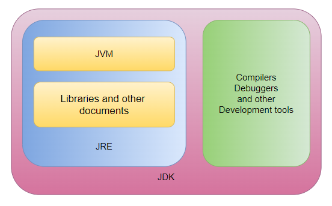
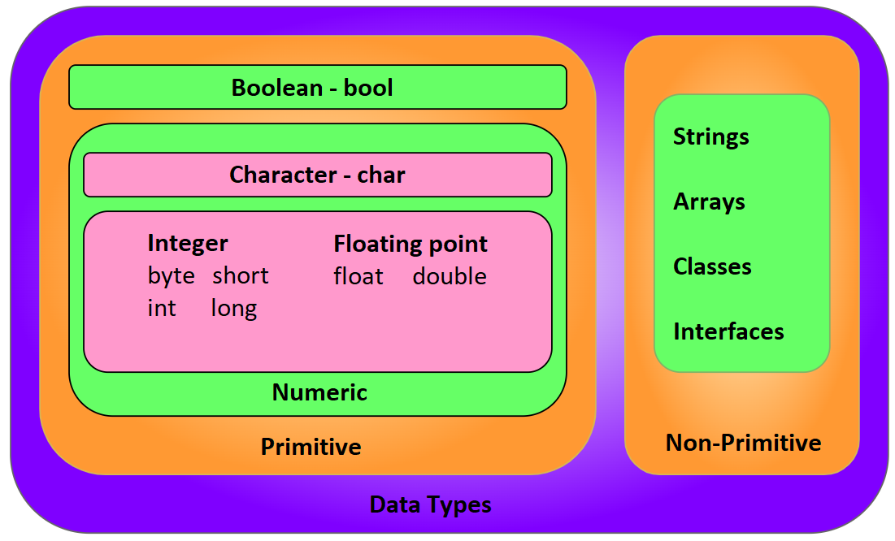
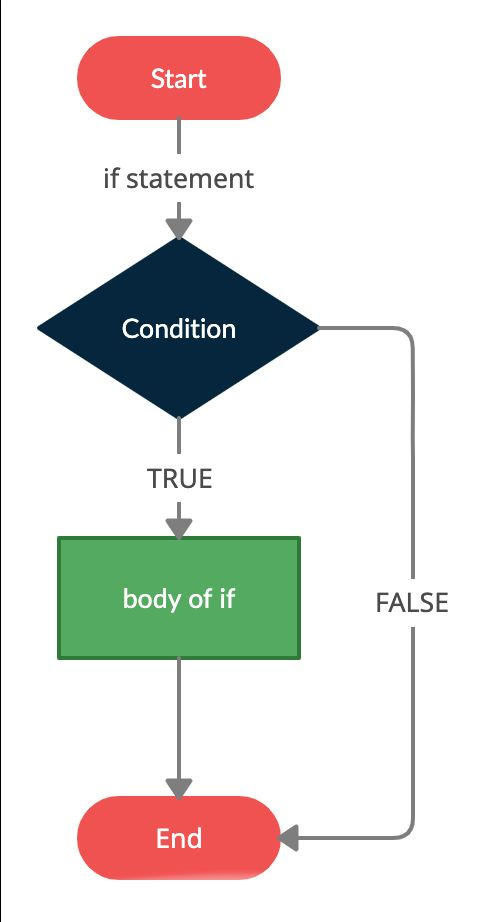
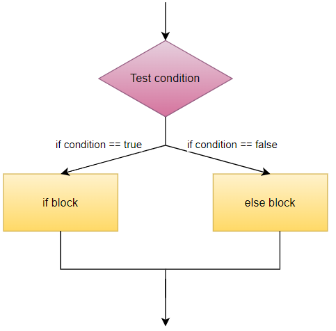
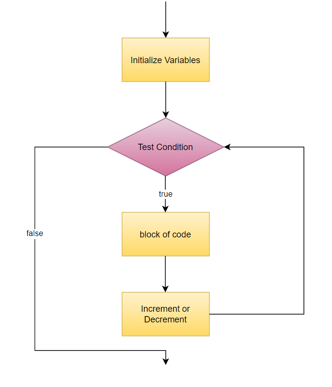
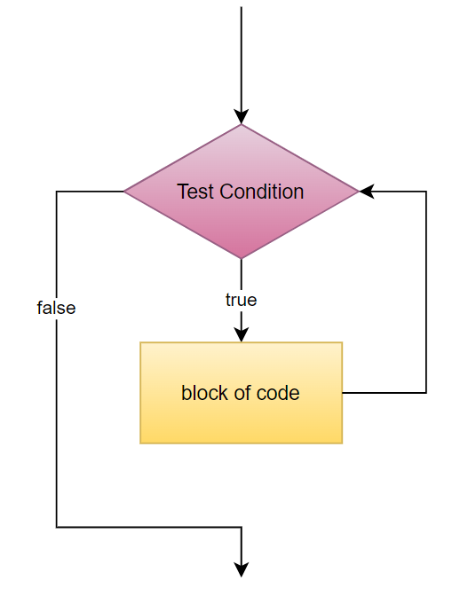

# TABLE OF CONTENTS

1. Introduction
    - [Java Overview](#11-java-overview)
    - [Installation & Setup](#12-installation--setup)
    - [JVM, JRE, JDK](#13-jvm-jre-jdk)
    - [Basic Java Syntax](#14-basic-java-syntax)
    - [Java Comments](#15-java-comments)
    - [Java Datatypes](#16-java-data-types)

2. Variables, Operators & User I/O
    - [Java Variables](#21-java-variables)
    - [Java Operators](#22-java-operators)
    - [User Input/Output](#23-user-inputoutput)

3. Conditional Statements
    - [if Statement](#31-if-statement)
    - [if…..else Statement](#32-ifelse-statement)
    - [if…..else if Statement](#33-ifelse-if-statement)
    - [Nested if Statements](#34-nested-if-statements)
    - [switch case Statements](#35-switch-case-statements)

4. Iteration Statements
    - [for loop](#41-for-loop)
    - [while loop](#42-while-loop)
    - [do-while loop](#43-do-while-loop)
    - [nested loop](#44-nested-loops)
    - [break/continue Statement](#45-breakcontinue-statement)

5. Strings
    - [String Basics](#51-string-basics)
    - [Escape Characters](#52-escape-characters)
    - [String Methods](#53-string-methods)

6. Arrays
    - [](51)

7. Java Methods
    - [](62)
    - [](61)

8. Java OOPS
    - [](74)
    - [](73)
    - [](72)
    - [](71)

9. File Handling
    - [](82)
    - [](81)

10. Advanced Topics
    - [](91)


# 1. Introduction

## 1.1. Java Overview

Java is an open-source, class-based, high-level, object-oriented programming language. Java is platform independent as the java programs are compiled into byte code that are platform independent.

### History
Java programming language was created by **James Gosling in 1995**. The original idea was to design a language for the television industry. Gosling worked along with his team also called the Green Team and the project they worked on was called Greentalk. This project was later named as OAK. The name OAK has its roots to the oak tree that stood outside Gosling’s office. This name had to be dropped later as it was already a trademark by Oak Technologies.

**So how was the name Java suggested?**

Since the language could no longer be named OAK, Gosling and his team had to come up with new name. The team considered various names like DNA, RUBY, JAVA, jolt, dynamic, revolutionary, SILK.

But the name had to unique and quite easy to say. The name JAVA occurred in gosling’s mind while having a cup of coffee at his office.

### Types of Java applications 

**A.    Web Application:**

Web applications are the applications that run on web browser using servlet, JSP, struts technologies. These technologies create java web applications and deploy them on server.

**B.    Mobile Application:**

These are mobile applications created using java :

- **Standalone Application:**

Standalone applications are executed by themselves without the need of other programs and files. Example of such an application is antivirus.

- **Enterprise Application:**

Some applications are designed for corporate organizations with the intent to control major process in real time. Such applications are called enterprise applications. Example of such an application is Oracle E-Business Suite, Microsoft Dynamics 365 etc

### Features


- Object Oriented: In object oriented programming everything is an object rather that function and logic.
- Simple: Java is simple to understand, easy to learn and implement.
- Secured: It is possible to design secured software systems using Java.
- Platform Independent: Java is write once and run anywhere language, meaning once the code is written, it can be executed on any software and hardware systems.
- Portable: Java is not necessarily fixated to a single hardware machine. Once created, java code can be used on any platform.
- Architecture Neutral: Java is architecture neutral meaning the size of primitive type is fixed and does not vary depending upon the type of architecture.
- Robust: Java emphasizes a lot on error handling, type checking, memory management, etc. This makes it a robust language.
- Interpreted: Java converts high-level program statement into Assembly Level Language, thus making it interpreted.
- Distributed: Java lets us create distributed applications that can run on multiple computers simultaneously.
- Dynamic: Java is designed to adapt to ever evolving systems thus making it dynamic.
- Multi-thread: multi-threading is an important feature provided by java for creating web applications.
- High-performance: Java uses Just-In-Time compiler thus giving us a high performance.

## 1.2. Installation & Setup
 
### Step 1

Before starting the installation processes, it is advisable to check if your PC already has Java installed. To do this, open the command prompt and type the following:
```
C:\Users\yourName>java -version
```
**Output:**
```
java version "20.0.1" 2023-04-18
Java(TM) SE Runtime Environment (build 20.0.1+9-29)
Java HotSpot(TM) 64-Bit Server VM (build 20.0.1+9-29, mixed mode, sharing)
```

### Step 2

If your system does not have Java installed, download it from the official website: https://www.oracle.com/java/technologies/downloads/

### Step 3

Run the downloaded file to install Java on your machine. 

### Step 4

- Right click on This PC (My Computer).
- Click on properties.
- Go to Advanced System Settings.
- Under this click on Environment Variables.
- Inside System Variables, select Path and click on Edit.
- Give the path of directory where Java is installed followed by a \bin.
- Repeat step 1 to check if Java has been set up and running on your machine.
 
Java programs can be written in normal text editor like a notepad or more complicated editors(IDE’s) like Netbeans, Eclipse or Visual Studio Code.

## 1.3. JVM, JRE, JDK
 


### **A. Java Virtual Machine (JVM)**

The Java Virtual Machine (JVM) is a virtual machine that provides a runtime environment to execute java bytecode.

The java program is converted into java bytecode which is then translated by the JVM into machine code which can be then understood by the CPU to get the output.

### **B. Java Runtime Environment (JRE)**

The Java Runtime Environment (JRE) provides java libraries, the JVM and other files and documents that are needed to run java applications.

### **C. Java Development Kit (JDK)**

The Java Development Kit (JDK) is a superset of JRE and is used to create java applications. There are three JDK provided by Oracle: Java Enterprise Edition (Java EE), Java Standard Edition (Java SE), and Java Mobile Edition (Java ME).

## 1.4. Basic Java Syntax

It is particularly important to follow the appropriate syntax while writing java code, as we might get errors for the slightest mistake in our code.

1. **The class name should be the same as that of the name of the java file**. And each line of code must be written inside a class. 

Example: program where file name and class name is different.
```java
package syntax1;

public class DEtails {
    public static void main(String[] args) {
        System.out.println("Java program with diff file name and class name");
      }
}
```
Output
```
The public type Details must be defined in its own file.
```

Example: program where file name and class name is same.
```java
package syntax1;

public class Details {
    public static void main(String[] args) {
        System.out.println("Java program with same file name and class name");
      }
}
```
Output
```
Java program with same file name and class name
```
As we can see from both the examples that even a slightest change in the name of file and class name still gives us an error.

2. **Each block of code is indented within the curly brackets{}.**

Example: see how each block is indented inside the parent block
```java
package syntax1;

public class Details {
    public static void main(String[] args) {
        System.out.println("Java program with same file name and class name");
      }
}
```

3. **Each java file must contain a main method that is needed to execute a java file.**

Example: java code without a main method gives an error
```java
package syntax1;

public class Details {
    System.out.println("Java program with same file name and class name");
}
```
Output
```
Build failed
```

## 1.5. Java Comments

Comments in any programming language are ignored by the compiler or the interpreter. A comment is a part of the coding file that the programmer does not want to execute, rather the programmer uses it to either explain a block of code or to avoid the execution of a specific part of code while testing.

There are two types of coments:

- Single-line comment
- Multi-line comment
 
### **A. Single Line Comments**

To write a single-line comment just add a ‘**//**’ at the start of the line.

Example:
```java
package syntax1;
public class Details {
    public static void main(String[] args) {
        //This is a single line comment
        System.out.println("Hello World!!!");
      }
}
```
Output
```
Hello World!!!
```

### **B. Multi Line Comments**

To write a multi-line comment just add a ‘**/*…….*/**’ at the start of the line.

Example:
```java
package syntax1;

public class Details {
    public static void main(String[] args) {
        /*This
         * is 
         * a
         * Multiline 
         * Comment
         */
        System.out.println("Hello World!!!");
      }
}
```
Output
```
Hello World!!!
```

## 1.6. Java Data Types
 
There are two forms of datatypes in Java: 
- Primitive data type
- Non-Primitive data type


 
- **bool**: Boolean data type consists of true and false values.
- **char**: char datatype is used to store characters.
- **byte**: The main purpose of byte is used to save memory and consists values in the range -128 to 127.
- **short**: consists values in the range -32768 to 32767.
- **int**: consists values in the range -2,147,483,648 to 2,147,483,647.
- **long**: consists values in the range -9,223,372,036,854,775,808 to 9,223,372,036,854,775,807
- **float**: can be used to deal with decimal numbers. Always recommended to use float rather than double because float saves memory.
- **double**: can be used to deal with decimal numbers.
 

Data Type|Size|Range
|--|--|--|
bool|1 bit|true, false
char|2 byte|a….z, A….Z
byte|1 byte|-128 to 128
short|2 byte|-32768 to 32767
int|4 byte|-2,147,483,648 to 2,147,483,647
long|8 byte|-9,223,372,036,854,775,808 to 9,223,372,036,854,775,807
float|4 byte|±1.4E-45 to ±3.4E38
double|8 byte|±4.9E-324 to ±1.8E308

> Note - Range lies from **-2^(n)** to **2^(n)-1** , where n is no. of bytes.

[Jump to Index](#table-of-contents)

<br>

## 2.1. Java Variables

Variables are containers that store information that can be manipulated and referenced later by the programmer within the code. Java variables have a data type associated with them which can tell us about the size and layout of the variable’s memory.

### Syntax
```java
datatype variable = value;
```

There are three types of variables in java:

- Local variable
- Instance variable
- Class/Static variable
 

### A. Local Variables
A variable that is declared inside the body of the method or constructor is called a local variable. It is called so because the extent of a local variable lies only within the method or constructor within which it is created and other methods in the class cannot access it.

Example
```java
public class LocalVariableExample {
    public static void main(String[] args) {
        int x = 10; // Declaring and initializing a local variable 'x' of type int

        System.out.println("The value of x is: " + x);

        {
            int y = 5; // Declaring and initializing a local variable 'y' of type int inside a block
            System.out.println("The value of y is: " + y);
        }

        // 'y' is not accessible outside the block, so trying to access it here would result in a compilation error

        int z; // Declaring a local variable 'z' of type int
        z = 15; // Assigning a value to 'z' later

        System.out.println("The value of z is: " + z);
    }
}
```

Output
```
The value of x is: 10
The value of y is: 5
The value of z is: 15
```

**If the local variable is accessed outside the method or constructor within which it is creaed, then it gives an error.**

Example
```java
public class test {
    public void localVariable() {
        String name = "Ben";
        int marks = 95;
    }

    public void notLocalVariable() {
        System.out.println(name + " Scored " + marks + "%.");
    }

    public static void main(String[] args) {
        test vt = new test();
        vt.localVariable();
        vt.notLocalVariable();
    }
}
```
Output
```
test.java:8: error: cannot find symbol
        System.out.println(name + " Scored " + marks + "%.");
                           ^
  symbol:   variable name
  location: class test
test.java:8: error: cannot find symbol
        System.out.println(name + " Scored " + marks + "%.");
                                               ^
  symbol:   variable marks
  location: class test
2 errors
``` 

### B. Instance Variables
In Java, instance variables (also known as member variables or fields) are variables declared within a class but outside of any method, constructor, or block. They hold data that is specific to each instance of the class, meaning that each object created from the class will have its own set of instance variables.

Instance variables are declared at the class level and are associated with an object or instance of the class. They are accessible throughout the class and can be used by any method within the class.

Here's an example of declaring and using instance variables in Java:

```java
public class test {
    // Instance variables
    private int age;
    private String name;

    // Constructor
    public test(int age, String name) {
        this.age = age;
        this.name = name;
    }

    // Method using instance variables
    public void printDetails() {
        System.out.println("Name: " + name);
        System.out.println("Age: " + age);
    }

    public static void main(String[] args) {
        // Create an instance of test
        test obj = new test(25, "John");

        obj.printDetails();

        // Access and modify instance variables
        obj.age = 20;
        obj.name = "Harshit Goel";

        // Call a method that uses instance variables
        obj.printDetails();
    }
}
```
Output
```
Name: John
Age: 25
Name: Harshit Goel
Age: 20
```

In this example, `age` and `name` are instance variables of the `MyClass` class. They are accessed and modified using the dot notation (`obj.age`, `obj.name`) within the `main()` method. The `printDetails()` method also uses these instance variables to display the object's details. Each instance of the class can have its own unique values for these instance variables.

### C. Class/Static Variables:
An static variable is declared inside the class but outside a method or a constructor. It is similar to a instance variable except that it is declared using the keyword **static**. These variables are accessible by all methods or constructors that are inside the class.

Example
```java
public class variableType {

    public static String name;
    public static int marks;

    public static void main(String[] args) {
        name = "Aman Gupta";
        marks = 95;
        System.out.println(name + " Scored " + marks + "%.");
    }
}
```
Output
```
Aman Gupta Scored 95%.
```
If variable is not declared static then it gives an error.

Example
```java
public class variableType {
    public String name;
    public int marks;

    public static void main(String[] args) {
        name = "Aman Gupta";
        marks = 95;
        System.out.println(name + " Scored " + marks + "%.");
    }
}
```

Output
```
Cannot make a static refrence to a non-static field
```

## 2.2. Java Operators
 
Java has different types of operators for different operations. They are as follows:

### Arithmetic operators
Arithmetic operators are used to perform arithmetic/mathematical operations.

Name|Operator|Example
|---|---|---|
Addition|+|a+b
Subtraction|-|a-b
Multiplication|*|a*b
Division|/|a/b
Modulus|%|a%b
Increment|++|a++ or b++
Decrement|--|a-- or b--

### Assignment operators
These operators are used to assign values to variables.

Name|Operator|Evaluated As
|---|---|---|
Assignment|=|a=b
Addition assignment|+=|a+=b    or    a=a+b
Subtraction assignment|-=|a-=b    or    a=a-b
Multiplication assignment|*=|a*=b    or    a=a*b
Division assignment|/=|a//=b    or    a=a//b
Modulus assignment|%=|a%=b    or    a=a%b
Bitwise AND assignment|&=|a&=b    or    a=a&b
Bitwise inclusive OR assignment|\|=|a\|=b    or    a=a\|b
Bitwise exclusive OR assignment|^=|a^=b    or    a=a^b
Right Shift assignment|>>=|a>>=b    or    a=a>>b
Left Shift assignment|<<=|a<<=b    or    a=a<<b

### Bitwise operators
Bitwise operators are used to deal with binary operations.

Name|Operator|Example
|---|---|---|
Bitwise AND|&|a & b
Bitwise OR|\||a \| b
Bitwise NOT|~|~a
Bitwise XOR|^|a ^ b
Bitwise right shift|>> |a>>
Bitwise left shift|<< |b<<
Unsigned right shift|>>> |a>>>

### Comparison operators
These operators are used to compare values.

Name|Operator|Example
|---|---|---|
Equal|==|a==b
Not Equal|!=|a!=b
Less Than|< |a>b
Greater Than|> |a<b
Less Than or Equal to|<=|a>=b
Greater Than or Equal to|>=|a<=b

### Logical operators
These operators are used to deal with logical operations.

Name|Operator|Example
|---|---|---|
AND|&&|a && b
OR|\|\| |a \|\| b
NOT|!|! (a=2 or b=3)

### Other operators

#### A. instanceof operator
This operator checks if an object is an instance of class.

Example
```java
class Main {
    public static void main(String[] args) {
  
        Integer number = 5;
        boolean res;
    
        if (res = number instanceof Integer){
            System.out.println("number is an object of Integer. Hence: " + res);
        } else {
            System.out.println("number is not an object of Integer.Hence: " + res);
        }
    }
}
```
Output
```
number is an object of Integer. Hence: true
```

#### B. Conditional operator
It is used in a single line if-else statement.

Example
```java
class Main {
    public static void main(String[] args) {
  
        Integer number = 3;
        String res;
    
        res = (number > 5) ? "number greater than five" : "number lesser than five";
        System.out.println(res);
    }
}
```
Output
```
number lesser than five
```

## 2.3. User Input/Output
 
### Taking Input
To use the Scanner class, we need to import the `java.util.Scanner` package.
```java
import java.util.Scanner;
```
Now the Scanner class has been imported. We create an object of the Scanner class to use the methods within it.
```java
Scanner sc = new Scanner(System.in)
```
The **System.in** is passed as a parameter and is used to take input.

> Note: Your object can be named anything, there is no specific convention to follow. But we normally name our object **sc** for easy use and implementation.

 
There are four ways to create an object of the Scanner class. Let us see how we can create Scanner objects:

- A. Reading keyboard input
```java
Scanner sc = new Scanner(System.in)
```
- B. Reading String input
```java
Scanner sc = new Scanner(String str)
```
- C. Reading input stream
```java
Scanner sc = new Scanner(InputStream input)
```
- D. Reading File input
```java
Scanner sc = new Scanner(File file)
```
### So how does a Scanner class work?

The scanner object reads the entered inputs and divides the string into tokens. The tokens are usually divided based upon whitespaces and newline.

Example:
```
Susan
19
78.95
O
```
The above input will be divided as “Susan”, “19”, “78.95” and “O”. Then the Scanner object will iterate over each token and then it will read each token depending upon the type of Scanner object created.

Now, we have seen how Scanner object is created, different ways to create it, how it reads input, and how it works. Let us see different methods to take inputs.

Below are the methods that belong to the scanner class:

Method|Description
---|---
nextLine()|Accepts string value
next()|Accept string till whitespace
nextInt()|Accepts int value
nextFloat()|Accepts float value
nextDouble()|Accepts double value
nextLong()|Accepts long value
nextShort()|Accepts short value
nextBoolean()|Accepts Boolean value
nextByte()|Accepts Byte value

Example
```java
import java.util.Scanner;

public class ScannerExample {
	public static void main(String[] args) {
		
        Scanner sc = new Scanner(System.in);
 
        System.out.println("Enter Name, RollNo, Marks, Grade");
        
        String name = sc.nextLine();		//used to read line
        int RollNo = sc.nextInt();			//used to read int
        double Marks = sc.nextDouble();		//used to read double
        char Grade = sc.next().charAt(0);	//used to read only 1 character at index 0 of the string
 
        System.out.println("Name: "+name);
        System.out.println("Roll No: "+RollNo);
        System.out.println("Marks: "+Marks);
        System.out.println("Grade: "+Grade);
        
        sc.close();
	}
}
```
Output
```
Enter Name, RollNo, Marks, Grade
Riya Yadav
13
97.25
A+
Name: Riya Yadav
Roll No: 13
Marks: 97.25
Grade: A
```

Entering the wrong type of input, or just messing up with the order of inputs in the above example will give an error.

For same example when we change the order of inputs it gives the following output:
```
Enter Name, RollNo, Marks, Grade
aman
gupta
Exception in thread "main" java.util.InputMismatchException
        at java.base/java.util.Scanner.throwFor(Scanner.java:947)
        at java.base/java.util.Scanner.next(Scanner.java:1602)
        at java.base/java.util.Scanner.nextInt(Scanner.java:2267)
        at java.base/java.util.Scanner.nextInt(Scanner.java:2221)
        at ScannerExample.main(ScannerExample.java:11)
```

[Jump to Index](#table-of-contents)

<br>

## 3.1. if Statement

Decision-making involves evaluating a condition to a Boolean value and making a decision based on it. The basic idea revolves around executing the block of code whose condition evaluates to true. Below are the types of decision-making statements:

- if statement
- if…..else statement
- if…..else if statement
- nested if statements
- switch statement

### 1. if statement



In a simple if statement, a block of code inside the if statement is only executed if the condition evaluates to true.

Syntax
```java
if (condition) {
    //block of code
}
```
Example
```java
public class JavaIf {
    public static void main(String[] args) {
        String name = "Anurag Nagvanshi";
        int Roll = 2;
        if (name == "Anurag Nagvanshi" && Roll == 2) {  // && - logical AND (is True when both the statements are True)
            System.out.println("Details of Anurag Nagvanshi.");
        }
    }
}
```
Output
```
Details of Anurag Nagvanshi.
```
Example
```java
public class JavaIf {
    public static void main(String[] args) {
        String name = "Mohan";
        int Roll = 25;
        if (name == "Mohan" && Roll == 26) {
            System.out.println("Details of Mohan.");
        }
    }
}
```
Output:
```
Above code won’t give an output.
```

## 3.2. if…..else Statement

In an if…..else statement we have two blocks of code, wherein the former block of code (code inside if statement) is executed if condition evaluates to true and the later block of code (code inside else statement) is executed if the condition is false.

Syntax
```java
if (condition) {
	//block of code
} else {
	//block of code
}
```



Example
```java
public class JavaIfElse {
    public static void main(String[] args) {
        String name = "Mohan";
        int Roll = 25;
        if (name == "Mohan" && Roll == 26) {
            System.out.println("Details of Mohan.");
        } else {
            System.out.println("Invalid details.");
        }
    }
}
```

Output
```
Invalid details.
```

## 3.3. if…..else if Statement

But what if we have more than two blocks of code? And what if we need to check which block of code evaluates to true? Well here we use an if…..else if statement.

if……else if statements allows us to check multiple expressions and enter the block of code where the condition evaluates to true.

### Syntax
```java
if (condition 1) {
    //block of code
} else if (condition 2) {
    //block of code
} else if (condition 3) {
    //block of code
} else if (condition 4) {
    //block of code
} else {
    //if no condition matches
    //block of code
}
```
 
Example
```java
public class JavaIf {
    public static void main(String[] args) {
        String name[] = {"Mohan", "Rohan", "Soham"};
        int Roll[] = {25, 36, 71};
        if (name[0] == "Mohan" && Roll[1] == 25) {
            System.out.println("Details of Mohan.");
        } else if (name[2] == "Rohan" && Roll[1] == 36) {
            System.out.println("Details of Rohan.");
        } else if (name[2] == "Soham" && Roll[2] == 71) {
            System.out.println("Details of Soham.");
        } else {
            System.out.println("Invalid details.");
        }
    }
}
```
Output
```
Details of Soham.
```

## 3.4. Nested if Statements

if statements inside other if statements are called nested if statements.

Example
```java
public class Nested {
    public static void main(String[] args) {
        String name = "Aman Kumar Gupta";
        int Roll = 6;
        int marks = 85;
        if (name == "Aman Kumar Gupta" && Roll == 6) {
            if (marks > 35) {
                System.out.println("Aman Kumar Gupta has been promoted to next class.");
            } else {
                System.out.println("Aman Kumar Gupta needs to give re-exam.");
            }
        }
    }
}
```
Output
```
Aman Kumar Gupta has been promoted to next class.
```

## 3.5. switch case Statements
In a switch statement, a block of code is executed based on the value of an expression matching one of the switch cases.

### Syntax
```java
switch (expression) {
  case value1:
    // code
    break;
  case value2:
    // code
    break;
  ...
  ...
  default:
    // default statements
  }
```

Example
```java
public class JavaSwitch {
    public static void main(String[] args) {
        String day = "Sunday";
        switch (day) {
          case "Sunday":
            System.out.println("Today is Sunday");
            break;
          case "Monday":
            System.out.println("Today is Monday");
            break;
          case "Tuesday":
            System.out.println("Today is Tuesday");
            break;
          case "Wednesday":
            System.out.println("Today is Wednesday");
            break;
          case "Thursday":
            System.out.println("Today is Thursday");
            break;
          case "Friday":
            System.out.println("Today is Friday");
            break;
          case "Saturday":
            System.out.println("Today is Saturday");
            break;
        }
    }
}
```

Output
```
Today is Sunday
```

[Jump to Index](#table-of-contents)

<br>

## 4.1. for Loop

Loops in any programming language are used to execute a block of code again and again until a base condition is achieved. As soon as a base condition is satisfied the loop is terminated and the control is returned to the main body of the program.

There are three types of loops in java:

- for loop
- while loop
- do……while loop
 

### for loop



Whenever a loop needs to be run a specific number of times, we use a for loop.

#### Syntax
```java
for (initializeVariable, testCondition, increment/decrement){
    //block of code
}
```
- **initializeVariable**: initialize a new variable or use an already existing one.
- **testCondition**: It checks the testing condition of the loop after each iteration and returns a Boolean value, which determines if the loop should be terminated or not.
- **Increment/decrement**: It is used to increment or decrement the variable after each iteraton.
 

Example
```java
public class ForLoop1 {
    public static void main(String[] args) {
        for(int i=1; i<=10; i++) {
            System.out.println("2 * "+ i+ " = "+ 2*i);
        }
    }
}
```
Output
```
2 * 1 = 2
2 * 2 = 4
2 * 3 = 6
2 * 4 = 8
2 * 5 = 10
2 * 6 = 12
2 * 7 = 14
2 * 8 = 16
2 * 9 = 18
2 * 10 = 20
```

We also have a special syntax for iterating through arrays and other collection objects, also called as a **for-each** loop.

### Syntax
```java
for (type variable : collectionObject){
    //block of code
}
```

Example
```java
public class ForEach1 {
    public static void main(String[] args) {
        int[] prime = {1,3,5,7,11,13,17,19};
        System.out.println("Prime numbers are:");
        for(int i : prime) {
            System.out.println(i);
        }
    }
}
```
Output
```
Prime numbers are:
1
3
5
7
11
13
17
19
```

And lastly we have an infinite for loop, wherein the expression always evaluates to true, hence running indefinitely.

Example
```java
public class ForLoop1 {
    public static void main(String[] args) {
        for(int i=1; i<=10; i--) {
            System.out.println(i);
        }
    }
}
```
Output
```
1
0
-1
-2
-3
-4
-5
-6
.
.
.
.
The loop will keep on running until you halt the program.
```

## 4.2. while Loop



Whenever we are not sure about the number of times the loop needs to be run, we use a while loop. A while loop keeps on running till the condition is true, as soon as the condition is false, control is returned to the main body of the program.

### Syntax
```java
while (baseBooleanCondition) {
    //block of code
}
```

- **baseBooleanCondition**: it checks if the condition is true or false after each iteration. If true, run block of code. If false, terminate the loop.

Example
```java
public class WhileLoop {
    public static void main(String[] args) {
        int i = 10;
        while (i>0) {
            System.out.println(i);
            i--;
        }
    }
}
```
Output
```
10
9
8
7
6
5
4
3
2
1
```

## 4.3. do-while Loop
A do…..while loop is a special kind of loop that runs the loop at least once even if the base condition is false. This is because the base condition in this loop is checked after executing the block of code. As such, even if the condition is false, the loop is bound to run atleast once. Hence, do…..while loop is also called as an **Exit Control Loop**.

### Syntax
```java
do {
    //block of code
} while (baseBooleanCondition);
```
 

### Example 1
```java
public class WhileLoop {
    public static void main(String[] args) {
        int i = 10;
        do {
            System.out.println(i);
            i--;
        } while (i>0);
    }
}
```
Output
```
10
9
8
7
6
5
4
3
2
1
``` 

### Example 2
```java
public class WhileLoop {
    public static void main(String[] args) {
        int i = 10;
        do {
            System.out.println(i);
            i--;
        } while (i>10);
    }
}
```
Output
```
10
As we can see, even if condition is false, the loop runs at least once.
```

## 4.4. Nested Loops
Loops inside other loops are called nested loops.

### Example
```java
public class Nested {
    public static void main(String[] args) {
        for (int i=1; i<5; i++) {
            for (int j=1; j<5; j++) {
                System.out.println(i+" * "+j+" = "+i*j);
            }
            System.out.println();
        }
    }
}
``` 
Output
```
1 * 1 = 1
1 * 2 = 2
1 * 3 = 3
1 * 4 = 4

2 * 1 = 2
2 * 2 = 4
2 * 3 = 6
2 * 4 = 8

3 * 1 = 3
3 * 2 = 6
3 * 3 = 9
3 * 4 = 12

4 * 1 = 4
4 * 2 = 8
4 * 3 = 12
4 * 4 = 16
```

## 4.5. break/continue Statement
 
### break statement
In java, **break** statement is used when working with any kind of a loop or a switch statement. It breaks out of the loop or a switch statement and returns the control to the main body of the program. In the case of nested loops, it breaks the inner loop and control is returned to the outer loop.

### Example
```java
public class JavaBreak {
    public static void main(String[] args) {
        for(int n=1; n<=20; n++) {
            if(n%2 == 0) {
                System.out.println(n);
                if (n == 12) {
                    break;
                }
            }
        }
    }
}
```

Output
```
2
4
6
8
10
12
``` 

### continue statement
The **continue** statement breaks the current iteration in the loop, if a specified condition occurs, moves to the end of the loop, and continues with the next iteration in the loop.

### Example
```java
public class JavaContinue {
    public static void main(String[] args) {
        for(int n=1; n<=20; n++) {
            if(n%2 == 0) {
                if (n == 12) {
                    continue;
                }
                System.out.println(n);
            }
        }
    }
}
```

Output
```
2
4
6
8
10
14
16
18
20
```

[Jump to Index](#table-of-contents)

<br>

## 5.1. String Basics
Strings in java is a sequence of characters that is enclosed in double quotes (**"**`<string>`**"**). Whenever java comes across a String literal in the code, it creates a string literal with the value of string.

### Example
```java
public class string {
    public static void main(String[] args) {
        String name;
        name = "Aman Kumar Gupta";
        System.out.println("My name is " + name);
    }
}
```
Output
```
My name is Aman Kumar Gupta
``` 

The same can be done using an array of characters.

### Example
```java
public class string {
    public static void main(String[] args) {
        char[] name = {'a', 'm', 'a', 'n', ' ', 'k', 'u', 'm', 'a', 'r', ' ', 'g', 'u', 'p', 't', 'a', ' ', '!', '!'};
        String welcomeMsg = new String(name);  
        System.out.println("Welcome " + welcomeMsg);
    }
}
```
Output
```
Welcome aman kumar gupta !!
``` 

### **Concatenate Strings**
Concatenation between two strings in java is done using the `+` operator.

### Example
```java
public class string {
    public static void main(String[] args) {
        String fname, mname, lname;
        fname = "Robert";
        mname = "Downey";
        lname = "Jr.";
        System.out.println(fname + " " + mname + " " + lname);
    }
}
```
Output
```
Robert Downey Jr.
``` 

Alternatively, we can use the **concat()** method to concatenate two strings.

### Example
```java
public class string {
    public static void main(String[] args) {
        String fname, mname, lname;
        fname = "Robert";
        mname = " Downey";
        lname = " Jr.";
        System.out.println(fname.concat(mname).concat(lname));
    }
}
```
Output
```
Robert Downey Jr.
``` 

> What if we concatenate string with an integer?
```
Well concatenating a string and an integer will give us a string.
```
### Example
```java
public class string {
    public static void main(String[] args) {
        String name;
        int quantity;
        quantity = 12;
        name = " Apples";
        System.out.println(quantity + name);
    }
}
```
Output
```
12 Apples
```

## 5.2. Escape Characters

Try running the code given below in your java compiler.
```java
public class string {
    public static void main(String[] args) {
        System.out.println("He said, "I believe that the Earth is Flat".");
    }
}
```
As we can see that the code gives an error. This is because the compiler assumes that the string ends after the 2nd quotation mark.

This can be solved by using ‘**\\**' (backslash). Backslash acts as an escape character allowing us to use quotation marks in strings.

### Example
```java
public class string {
    public static void main(String[] args) {
        System.out.println("He said, \"I believe that the Earth is Flat\".");
        System.out.println("she said, \'But the Earth is spherical\'.");
    }
}
```
Output
```
He said, "I believe that the Earth is Flat".
she said, 'But the Earth is spherical'.
```

> Similarly to use a backslash in the string we must escape it with another backslash.

### Example
```java
public class string {
    public static void main(String[] args) {
        System.out.println("The path is \\home\\aman\\Desktop\\GitHub\\Java-notes-and-codes\\README.md");
    }
}
```
Output
```
The path is \home\aman\Desktop\GitHub\Java-notes-and-codes\README.md
```

We also have an escape character for printing on a new line(**\n**), inserting a tab(**\t**), backspacing(**\b**), etc.

### Example
```java
public class string {
    public static void main(String[] args) {
        System.out.println("My name is Peter Parker. \nI'm Spiderman.\nWith great power comes great responsibility.🕷");
        System.out.println();
        System.out.println("Age:\t20");
        System.out.println("Addresss\b: Queens, New York");
    }
}
```
Output
```
My name is Peter Parker. 
I'm a Spiderman.
With great power comes great responsibility.🕷

Age:	20
Address: Queens, New York
```

## 5.3 String Methods
 

Here we will see some of the popular methods we can use with strings.

- `length()`: This method is used to find the length of a string.

### Example
```java
public class string {
    public static void main(String[] args) {
        String truth = "I am Spiderman !!";
        System.out.println(truth.length());
    }
}
```
Output
```
17
``` 

- `indexOf()`: This method returns the first occurrence of a specified character or text in a string.

### Example

```java
public class string {
    public static void main(String[] args) {
        String quote = "To be or not to be";
        System.out.println(quote.indexOf("be"));    //index of text
        System.out.println(quote.indexOf("r"));     //index of character
    }
}
```
Output
```
3
7
```
 
- `toLowerCase()`: Converts string to lower case characters.

### Example
```java
public class string {
    public static void main(String[] args) {
        String quote = "THOR: Love and Thunder";
        System.out.println(quote.toLowerCase()); 
    }
}
```
Output
```
thor: love and thunder
``` 

- `toUpperCase()`: Converts string to upper case characters.

### Example
```java
public class string {
    public static void main(String[] args) {
        String quote = "THOR: Love and Thunder @123";
        System.out.println(quote.toUpperCase());     
    }
}
```
Output
```
THOR: LOVE AND THUNDER @123
```

[Jump to Index](#table-of-contents)

<br>
